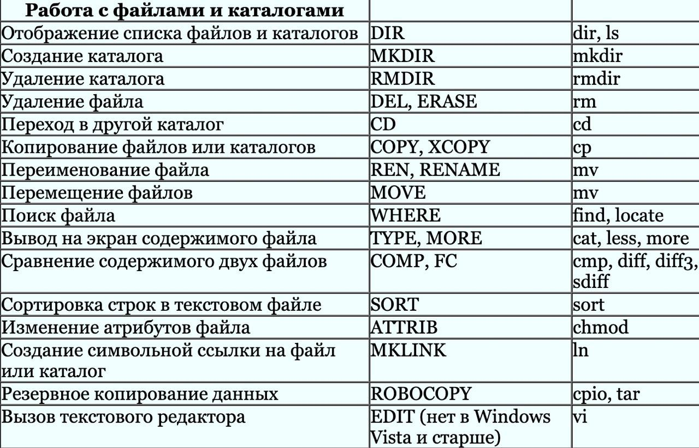
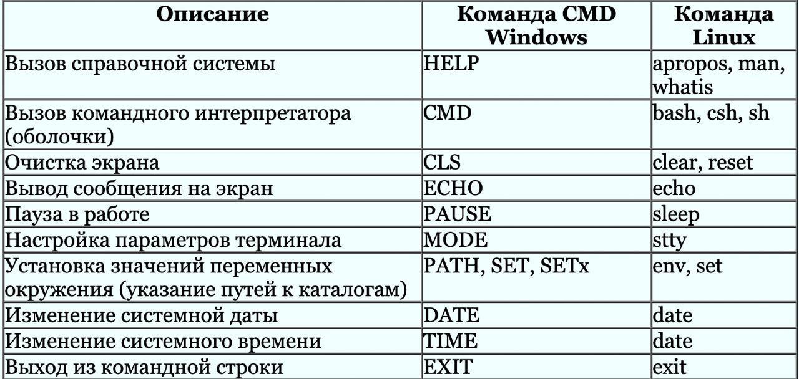
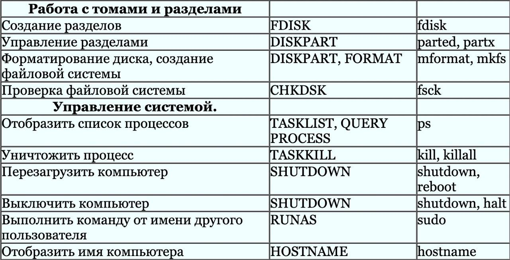
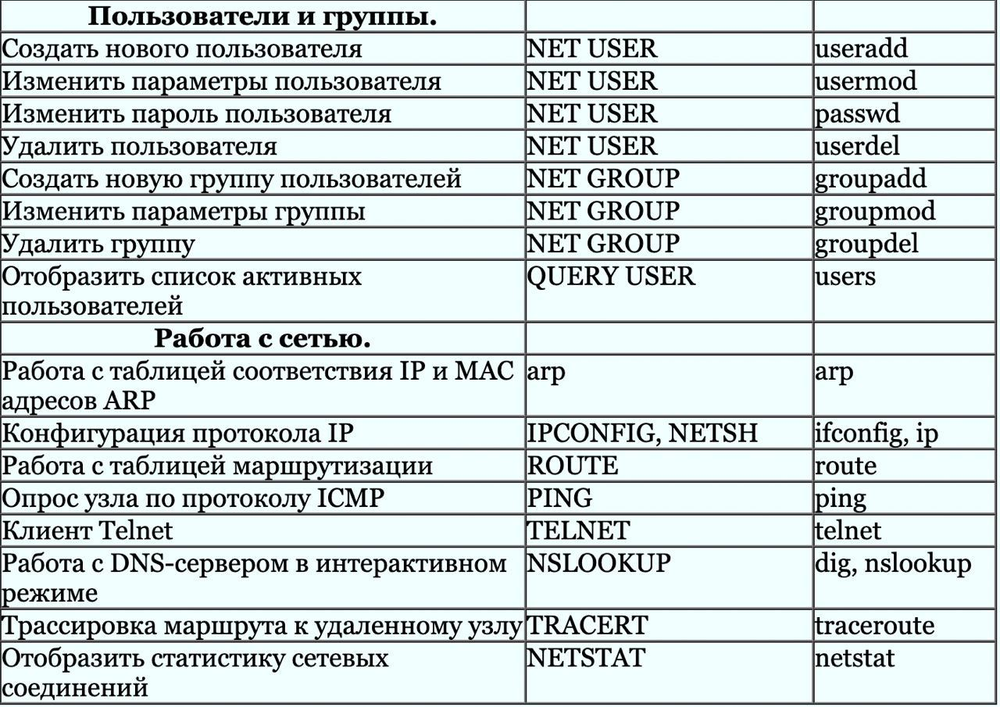
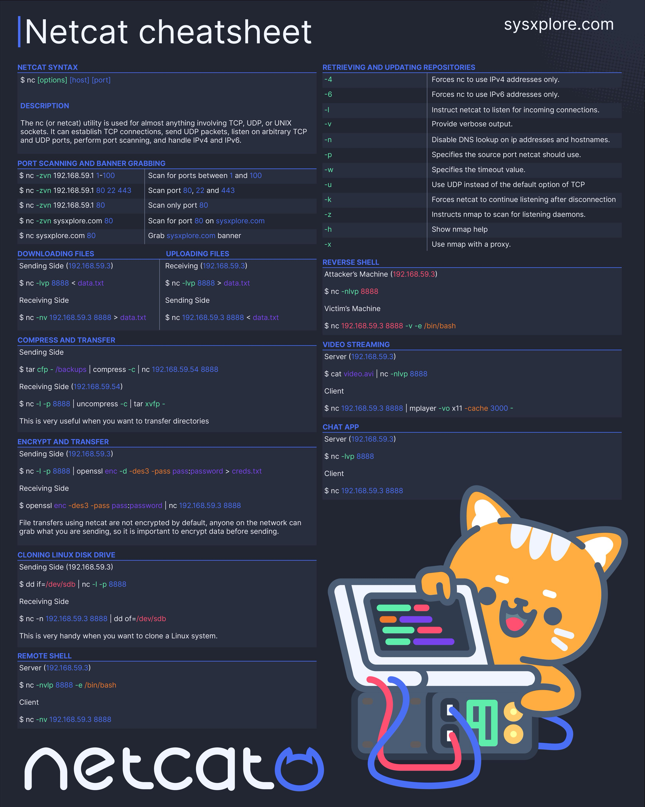

*Простая команда UNIX с аргументами выглядит следующим образом:*
```commandline
команда [опции] [другие параметры]

(Квадратные скобки […] означают, что аргумент необязателен.)
```

```commandline
id

Выводит сведения о текущем пользователе
Вывод: uid=0(root) gid=0(root)
```

```commandline
uname

Выводит название ОС
Вывод: Linux
```

```commandline
cat
выводит содержимое файла в терминал. Полезно для маленьких файлов, неудобно для больших

Помните, что "cat" не работает с директориями.

cat file1 file2
В терминале мы увидим оба этих файла, выведенные один за другим.

Подсказка: Второй частый случай использования "cat" - объединение файлов. Чтобы "склеить" содержимое файлов, вы можете выполнить следующее:
cat file1 file2 ... fileN > resulting_file
```

```commandline
less
печатает содержимое файла на терминале с использованием страниц и прокрутки. Также позволяет осуществлять строковый поиск в открытых файлах (с помощью тех же горячих клавиш, что и инструмент "man"). Чрезвычайно полезна для чтения больших файлов.

less /some/file

Клавиши "Page Up" и "Page Down" можно использовать для прокрутки страницы.
Есть также возможность поиска по всему содержимому. Для этого нужно нажать "/", затем набрать точный шаблон для поиска, и использовать "n" для перехода к следующему вхождению, и "Shift + n" для предыдущего

```

```commandline
egrep
выводит на терминал строки, соответствующие шаблонам.
Поиск подстрок в текстовых файлах, особенно в огромных журналах (логах), которые невозможно читать и в которых невозможно искать вручную

Если вы хотите найти "something" в файлах, вам нужно выполнить:
egrep "something" file1 file2 ... fileN

В позиционных параметрах может быть указано много файлов - в таких случаях команда "egrep" будет искать этот шаблон во всех из них.
Команда "egrep" выводит все строки, в которых найдена эта подстрока ("something" в нашем случае). Если она не найдена нигде во всех входных файлах, "egrep" ничего не выводит.
Например, вы можете запустить egrep bash /etc/passwd, чтобы найти и вывести все строки, содержащие "bash" в файле /etc/passwd.
```
*Поведение egrep можно изменить с помощью опций, наиболее частые из которых - '-i', '-r', '-v' и '-l' (строчная буква 'L'). Их значение следующее:*

```commandline
'-i': сделать поиск нечувствительным к регистру символов egrep -i "pattern" /some/file выведет строки, содержащие не только "pattern", но и PATTERN, pAtTeRN и т.д.
'-v': вывести все строки, не соответствующие шаблону
'-l': вывести имена файлов (не строк), в которых найден данный шаблон (если таковые имеются)
'-r': поиск шаблона во всех файлах в заданном каталоге и вывод найденных совпадений строк
egrep -r root /etc выведет все строки из всех файлов в каталоге /etc (и его подкаталогах), содержащие подстроку "root".
```

```commandline
head
выводит на терминал первые N строк из файла.

head -n X input_file
```

```commandline
tail
печатает последние N строк из файла на терминал. Также позволяет видеть изменения файла в режиме реального времени, когда программа добавляет новые строки в этот файл. Это чрезвычайно полезно, когда вы мониторите работающее приложение.

tail -n X input_file
Где X определяет количество строк, которые будут выведены на печать, а "input_file" - путь к этому файлу. По умолчанию отображаются последние 10 строк.

Например, вы можете выполнить команду

tail -n 5 /etc/passwd

чтобы показать только последние 5 строк из файла /etc/passwd.

мониторинг изменений файла в реальном времени:
tail -f input_file
Чтобы остановить выполнение, просто нажмите Ctrl+C.
```

```commandline
wc
подсчитывает количество символов, слов и (самое полезное) строк во входных файлах.

Наиболее полезным является случай, связанный со строками, для этого необходим '-l' (строчная буква 'L'):
wc -l input_file
Таким образом, мы можем увидеть, сколько строк находится в указанном файле.
```

```commandline
sort
сортирует входные данные, может делать это в алфавитном (по умолчанию) или числовом (требуется опция '-n') порядке.

sort /etc/passwd печатает содержимое файла, отсортированное в алфавитном порядке
sort -t ":" -k 3 -n /etc/passwd печатает содержимое того же файла, отсортированное в числовом порядке, но a) берет значения для сортировки из 3-го поля b) использует ":" в качестве разделителя полей.
```

```commandline
uniq
может удалять дублирующиеся строки, печатать только уникальные строки и показывать только дублирующиеся строки.
```










