```commandline
/etc: файлы конфигурации для большинства приложений и некоторых частей ОС
/home: как правило, используется для хранения домашних директорий пользователей, например /home/ваше_имя_пользователя. Аналогично C:\Users в Windows.
/root: домашняя директория пользователя root (это единственный пользователь-администратор во всех UNIX-подобных ОС).

/bin: большинство исполняемых файлов (например, программ) хранится здесь. В современных версиях Linux директория /bin часто служит так называемой символьной ссылкой на директорию /usr/bin, а не "настоящей" директорией - если кратко, любая операция, затрагивающая /bin/something будет фактически выполняться на /usr/bin/что-нибудь. О подробностях работы с символьными ссылками мы поговорим позже.

/sbin: похож на /bin, но хранит специальные исполняемые файлы, служащие для конфигурации системы и обычно запускаемые только пользователем root.
/tmp: временные файлы ОС и приложений (аналог C:\Temp в ОС Windows).

/var: содержит различные файлы с кэшем системы, файлы журналов и файлы баз данных (если сервер БД установлен). Директория /var/log хранит файлы журналов системы и большинства приложений.

/usr: в настоящее время это главное место для приложений (исключая настройки, хранящиеся в /etc). Например: /usr/bin содержит исполняемые файлы, /usr/lib — разделяемые библиотеки и т. д.
```

### Формат текстовых файлов UNIX
*В UNIX-подобных ОС, включая Linux, текстовые файлы имеют свой собственный формат, отличный от Windows.*

+ Их строки заканчиваются символом '\n' (он не отображается на терминале, но все же существует), который также называется LF, его ASCII-код - 10 (0xA в шестнадцатеричной системе).
+ Символы '\r\n' играют ту же роль в Windows, символ '\r' также называется CR, его ASCII код - 13 (0xD в шестнадцатеричной системе).

Можно использовать очень простую команду "file", которая определяет формат указанных файлов
```commandline
file passwd*
passwd: 	ASCII text
passwd.win: ASCII text, with CRLF line terminators
```
*"ASCII text" показан для исходных текстовых файлов UNIX, а "ASCII text, with CRLF line terminators" для текстовых файлов Windows.*

*Чтобы преобразовать их в командной строке Linux, вы можете использовать инструменты "dos2unix" и "unix2dos" соответственно (если они, конечно, установлены).*

## Методы перенаправления вывода

### *stdout*
Представьте, что у нас есть программа, которая быстро генерирует множество выходных строк в stdout.
мы можем использовать одну из следующих техник:
```commandline
some_program > output_file_rewrite
some_program >> output_file_append

'>' перезапишет файл
'>>' добавит stdout программы к содержимому существующего файла

Например:
egrep root /etc/passwd > file.txt
```
*Оба метода создают выходной файл, если он не существовал ранее.*  
В обоих случаях, показанных выше, stdout программы будет записан в указанный файл, а не в терминал.

### *stderr*
Если вы хотите сохранить сообщения об ошибках отдельно от "полезного" вывода, можно запустить программу следующим образом:
```commandline
egrep root /no/such/file 2> file.txt
egrep root /no/such/file 2>> file.txt
```
*Важные замечания о перенаправлении stderr:*
+ Не забудьте указать '2', если вы работаете с stderr
+ Пробелы между '2' и '>' (или '>>') не допускаются, поэтому:
  + '2> файл', '2>> файл' разрешены
  + 2 > файл", "2 >> файл" являются неправильными

*'2' - это внутренний номер (или ID) потока stderr. Между тем, stdout имеет ID 1, но вам не нужно набирать '1> output_file', так как перенаправление stdout используется по умолчанию.*

### *Объединение stdout и stderr*
```commandline
some_program > output_file 2>&1

Это работает следующим образом:
-Stderr перенаправляется в stdout (порядок перенаправления - "чтение" справа налево)
-Stdout записывается в "output_file"

В результате, оба потока (stdout и stderr) будут записаны в один файл.

Пример:
egrep root /etc/passwd /no/such/file > file.txt 2>&1
```

### */dev/null*
Часто, но не всегда, лучше полностью игнорировать ошибки или stdout, и показывать только один поток. Для этих целей существует специальное псевдоустройство /dev/null - вы можете записать на него что угодно, и эта информация исчезнет, как в черной дыре.
```commandline
egrep root /no/such/file 2>/dev/null
```

Если хотите проигнорировать обычные сообщение, напишите так:
```commandline
egrep root /etc/passwd /no/such/file > /dev/null
```

## *Пайпы (pipes)*
*Пайпы (Pipes) предназначены для перенаправления stdout одной программы в stdin другой.*

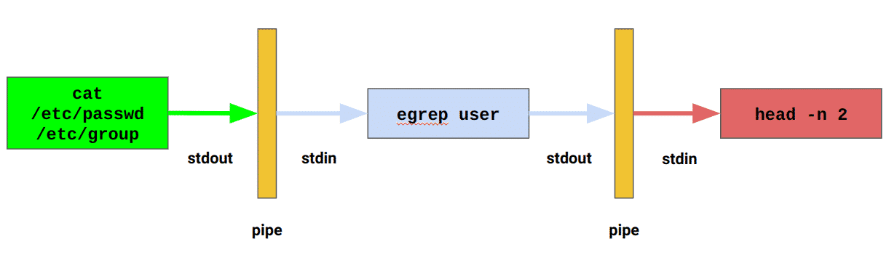

### *stdin*
Используется для получения входных данных - как поток, а не как входной файл.

*Примеры*
```commandline
egrep user /etc/group
"egrep" просто читает входной файл. Здесь нет ничего, связанного с входными потоками
```

```commandline
cat /etc/group | egrep user
"cat" просто печатает входной файл в stdout. Затем, с помощью пайпа через '|' между "cat" и "egrep", это содержимое передается в виде потока на stdin egrep. "egrep" читает свой stdin и ищет заданный шаблон.
```

```commandline
egrep user < /etc/group
"egrep" заполняет свой stdin из файла, указанного после '<', и ищет шаблон в потоке входных данных.
```

#### *Примечание:*
не пытайтесь заполнить stdin команды через pipe и '<' одновременно. В этом случае на вход будет принят только файл, а stdout предыдущей команды будет проигнорирован. Итак:
```commandline
cmd1 | cmd2 - верно
cmd2 < /some/file - верно
cmd1 | cmd2 < /some/file - неверно, поскольку cmd2 получит на вход тольк содержимое /some/file, при этом результат cmd1 будет проигнорирован.
```

*Примеры*
```commandline
cat /etc/passwd /etc/group ~/.bash_history | egrep user
печатает все строки, содержащие "user", из нескольких файлов, объединенных программой cat

cat /etc/passwd /etc/group ~/.bash_history | egrep user | less
делает то же самое, но показывает это в постраничном представлении, обеспечиваемом"less"

egrep "cat" ~/.bash_history | sort | uniq
ищет строки, содержащие "cat" в истории команд, затем печатает только уникальные строки без дубликатов

egrep "cat" ~/.bash_history | sort | uniq | wc -l
показывает количество строк, найденных выше
```
*Важные замечания*
+ Пайпы похожи на '>' и '>>', поэтому ваш stdout НЕ будет отображаться в терминале.
+ Stdout может быть записан в файл ИЛИ передан в stdin следующей команды, но НЕ одновременно.  Поэтому НЕ ожидайте, что что-либо будет передано в "next_command" в примере ниже.
````commandline
some_command > result | next_command

поскольку stdout команды some_command уже был записан в файл "result", для заполнения stdin следующей команды (т.к. next_command) ничего не остается.
````

+ Пайпы могут работать только с stdout, поэтому
  + Если что-либо было выведено на stderr, и stderr не был обработан отдельно, вы также увидите сообщения stderr среди обработанных строк. Схематично это показано на рисунке ниже:
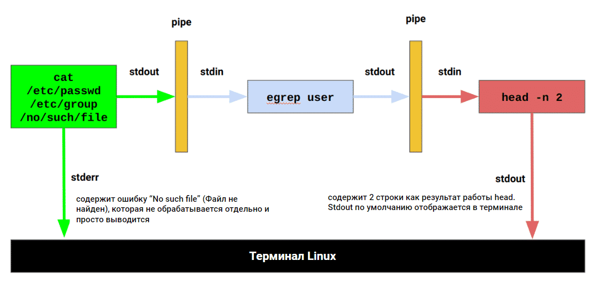
*В этом примере 1-й stderr не обрабатывается, поэтому он выводится на терминал так же, как и результат "head".*
+ Если вы хотите работать через пайпы с stderr, можно использовать конструкцию ниже. Она объединяет stdout и stderr для "next_command":
````commandline
some_command 2>&1 | next_command
````
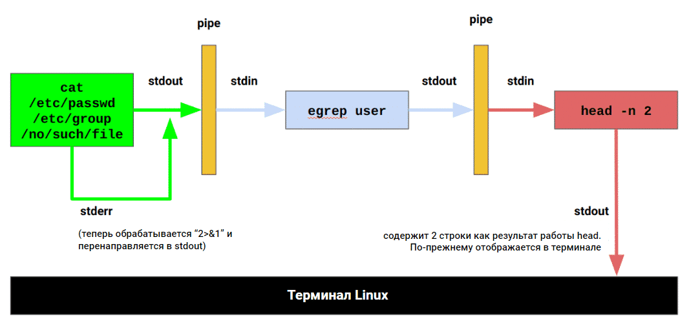
*Пайплайн из предыдущей схемы теперь работает по-другому, так как 1-й stderr обрабатывается и объединяется с stdout.*

*Более сложная конструкция:*
````commandline
some_command 2>&1 >/dev/null | next_command

будет игнорировать stdout команды some_command, перенаправлять ее stderr в stdout и предоставлять его в качестве входных данных для "next_command". То есть, если вы хотите работать только с stderr и полностью игнорировать stdout, вы можете ее использовать.
````

Чтобы понять эти принципы, выполните команды:
````commandline
cat /etc/passwd /etc/group | egrep "no such pattern"

Ничего не выводится, поскольку:
a) stdout cat был полностью отправлен в stdin egrep 
b) egrep не нашел ни одной строки с "no such pattern".
````

````commandline
cat /etc/passwd /etc/group > /tmp/result.file | egrep "user"

stdout cat был полностью записан в /tmp/result.file, поэтому egrep принимал пустые входные данные. Если же вы запустите
cat /etc/passwd /etc/group | egrep "user"
некоторые строки с высокой долей вероятности будут напечатаны.
````

*Теперь stderr и пайпы:*
````commandline
cat /etc/passwd /etc/group /no/such/file1 /no/such/file2 | egrep root | head -n 2

Вы, вероятно, ожидаете только 2 строки в выводе (из-за "head -n 2"), но на самом деле увидите четыре: две "паразитные" строки с ошибками "No such file or directory" (потому что они были выведены на stderr, сам stderr не был ни перенаправлен, ни проигнорирован) и две "нормальные" строки, в которых найдется шаблон.
````

````commandline
cat /etc/passwd /etc/group /no/such/file1 /no/such/file2 2>&1 | egrep "No such file or directory" | head -n 2

Эта конструкция печатает только 2 первые строки, содержащие подстроку "No such file or directory", найденные в объединенных stdout и stderr cat, другие строки не печатаются, и это ожидаемое поведение (поскольку поток ошибок был объединен со стандартным выводом).
````
## Учетные записи ОС
````text
В UNIX-подобных операционных системах существует несколько типов пользователей ОС (т.е. учетных записей):

Стандартные учетные записи: создаются для обычных пользователей
Административная учетная запись: ее имя - root, и она является единственным администратором ОС (у вас не может быть двух root). Учетная запись root используется для прямого входа в систему очень редко; вместо этого администраторы временно повышают свои привилегии до root для обслуживания системы и других важных операций.
Служебные учетные записи: создаются для служб и других специальных целей; не должны использоваться пользователями. Например, для запуска бэкэнд-приложения (или приложения сервера базы данных) должна использоваться отдельная учетная запись.  Это минимизирует возможные последствия в случае сбоя или взлома приложения.
````
### *В чем разница:*
````text


Стандартные учетные записи: могут входить в систему, выполнять команды и читать некоторые файлы или директории. Они не могут изменять любую часть ОС и "общесистемных" приложений. По умолчанию они могут изменять данные только в своих домашних директориях и /tmp.
Административная (root) учетная запись: может входить в систему и делать все с ОС и пользователями без каких-либо ограничений (в отличие от Windows, где учетная запись администратора не настолько мощная, как учетная запись "Локальная система").
Служебные учетные записи: не могут входить в систему. ОС, службы и приложения (запускаемые root) используют их для специальных целей, например, для запуска определенных программ, служб и т.д.
````

### Основные настройки учетной записи: /etc/passwd
/etc/passwd - это основной конфигурационный файл для учетных записей пользователей, который используется, когда:
+ Пользователь входит в систему по SSH, FTP и другим средствам/протоколам.
+ ОС или любая программа требует, чтобы имя пользователя было сопоставлено с числовым UID (см. ниже) или наоборот.
+ Что вы можете видеть относительно своей учетной записи: (помните, "${USER}" означает ваше имя пользователя)

````commandline
[feodor@c7-sandbox ~]$ egrep "${USER}" /etc/passwd
feodor:x:1000:100:User Description Here:/home/feodor:/bin/bash
````
Рассмотрим содержимое и формат этого файла. В качестве разделителя полей используется ':', таким образом:
+ feodor - имя пользователя, должно быть уникальным
+ x - поле не используется, поэтому мы имеем здесь 'x' как заглушку
+ 1000 - идентификатор пользователя, называемый "UID", должен быть уникальным. Пользователи в основном имеют UID >= 1000. Пользователь root всегда имеет UID 0. Учетные записи служб имеют UID от 1 до (в основном) 999. Никто, кроме root, не должен иметь UID 0.
+ 100 - идентификатор основной группы. Каждый пользователь должен быть членом хотя бы одной группы (не существует пользователей "без групп"). Если пользователей нужно включить в большее количество групп, это настраивается в /etc/group (см. следующий раздел).
+ User Description Here - это поле может быть пустым или содержать что угодно, кроме ':'. Оно не играет никакой роли в ОС и механизмах входа в систему.
+ /home/feodor - домашний каталог пользователя; вы автоматически помещаетесь сюда после успешного входа в систему
+ /bin/bash - программа, выполняемая при успешном входе в систему. Сервисные учетные записи не предназначены для входа в систему и работы в командной строке, поэтому у них здесь указаны специальные "псевдо" программы, такие как /bin/false или /sbin/nologin

### *Заметки по безопасности/стабильности:*

+ Только root может изменять /etc/passwd - иначе хакеры могут повысить привилегии, создав "фальшивого рута" с UID 0.
+ Любой пользователь или приложение должны иметь доступ на чтение к этому файлу - иначе ОС становится нестабильной.
+ Хеши паролей хранятся в файле /etc/shadow, доступ к которому имеет только root. Несколько слов о хэшах: это набор однонаправленных криптографических функций, таких как хорошо известные MD5, SHA-512 и т.д. Если кто-то (например, вы или ОС) знает исходный пароль, он может быть легко преобразован в хэш. Но если вы знаете только хэш, получить начальный пароль будет очень сложно.
+ Эти особые разрешения /etc/shadow используются для того, чтобы избежать атак методом перебора. В противном случае любой может прочитать хэши, а затем попытаться подобрать правильный пароль к определенному хэшу. Файл /etc/shadow также содержит все настройки паролей учетных записей ОС, например, когда пароль должен быть изменен и т.д.

## Группы ОС
+ Группы включают несколько (0 или более) пользователей для упрощения управления пользователями и разделения привилегий
+ Каждый пользователь должен быть членом как минимум одной группы - она задается в /etc/passwd, такая группа называется "основной" для конкретного пользователя
+ Каждый пользователь может быть включен в 0 или более дополнительных групп, называемых "вторичными группами" (secondary groups). Членство во вторичных группах настраивается в файле /etc/group.
+ Нет никакой разницы (в плане привилегий) между членством в первичной и вторичной группах, например: если ваш пользователь входит в группу "qa" и группу "users", вы можете читать файлы, доступные как группам "qa", так и "users".
+ Группы полезны для назначения разрешений на доступ к файлам и других привилегий или ограничений, например:
  + кто может читать/писать/исполнять файл
  + кто может войти в систему через SSH
  + кто и как может использовать инструменты "sudo" или "su"
  + кто может читать журналы общесистемных служб с помощью инструмента "journalctl"
  + сколько процессора/памяти/дискового пространства может быть израсходовано

#### *Заметки*
+ Имена групп чувствительны к регистру, как и почти все в мире UNIX. т.е. группы "users" и "Users" - это разные группы.
+ В отличие от Windows, в UNIX нет группы "Администраторы".
+ В большинстве систем членство в группе "root" не дает многих привилегий, в отличие от статуса пользователя "root".
+ Могут существовать специальные группы с дополнительными привилегиями, это сильно зависит от настроек вашей ОС. Например, группы "sudo" или "wheel" могут иметь (а могут и не иметь) неограниченные права на выполнение любых команд от имени root через "sudo".

### *Основные настройки групп: /etc/group*
+ ОС или какой-либо программе требуется преобразовать имя группы в числовой GID (см. ниже) или наоборот.
+ Пользователь пытается сделать что-то, что может быть ограничено или разрешено функциями управления группами (например, чтение файла)
+ [опционально, если службы входа настроены таким образом] Пользователь входит в систему (SSH, FTP, другие протоколы).

Если вы посмотрите в /etc/group и найдете свое имя пользователя, вы можете увидеть что-то вроде этого:
````commandline
[feodor@c7-sandbox ~]$ egrep "$USER" /etc/group
wheel:x:10:feodor
users:x:100:feodor,[ ... a lot of users here ... ]
feodor:x:1000:
qa:x:1001:feodor,user1,user2
````

Рассмотрим последнюю строку примера выше:
+ Название группы
+ Всегда 'x'
+ Идентификатор группы, называемый "GID", должен быть уникальным
+ Список членов группы, разделенный запятыми, может быть пустым

Показать только UID текущего пользователя и ничего больше:
````commandline
[feodor@c7-sandbox ~]$ id -u
1000
````

Показать только GID или только имена групп текущего пользователя:
````commandline
[feodor@c7-sandbox ~]$ id -G
1000 10 100 987 1001
[feodor@c7-sandbox ~]$ id -Gn
feodor wheel users docker qa
````

Еще один способ получить имена групп:
````commandline
[feodor@c7-sandbox ~]$ groups
feodor wheel users docker qa
````

## "su": Переключить пользователя
Команда su используется для запуска оболочки от имени другого пользователя (по умолчанию root) после предоставления пароля пользователя.
Чтобы вернуться к предыдущему пользователю, выполните команду "exit".

Выполнение команды (или нескольких команд) от имени root, без запуска полнофункционального сеанса оболочки root:
````commandline
[st00@c7-sandbox ~]$ su - -c "id -u; whoami"
Password:
0
root
````
Всегда лучше использовать "su -" вместо "su", так как ключ "-" загружает все окружение оболочки целевого пользователя.

## "sudo": Substitute User Do
Инструмент sudo используется для запуска команды от имени другого пользователя (по умолчанию root) после предоставления пароля. "sudo" может быть настроен на разрешение или запрет выполнения определенных команд и их аргументов.

### *"sudo" обычно может использоваться как:*
````commandline
# Чтобы проверить возможности пользователя
sudo -l

# Чтобы запустить команды
sudo [-u username] command args
````
Где:
+ -u имя пользователя: какой пользователь будет выполнять эту команду (по умолчанию root, если не указано)
+ -l (строчная буква "L"): чтобы увидеть, какие команды вы можете выполнять
command, args - что выполнить с привилегиями другого пользователя

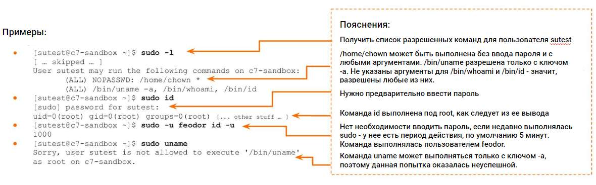

## sudo VS su: Основные различия
|                                     | su                                                                                                                               | sudo                                                                                                                                                     |
|-------------------------------------|----------------------------------------------------------------------------------------------------------------------------------|----------------------------------------------------------------------------------------------------------------------------------------------------------|
| Основная функциональность           | Предоставление оболочки входа в систему с привилегиями целевого пользователя, по умолчанию root                                  | Выполнение одной команды от имени целевого пользователя, по умолчанию root                                                                               |
| Основная идея                       | Работа в полнофункциональной оболочке как root или любой другой пользователь ОС                                                  | Делегирование некоторых административных полномочий обычным пользователям                                                                                |
| Какой пароль вводить                | Пароль целевого пользователя                                                                                                     | Ваш собственный пароль                                                                                                                                   |
| Необходимые настройки               | Возможно, вас нужно будет включить в специальную группу для запуска "su" (если это установлено вашим системным администратором). | Точные команды и даже их аргументы могут быть разрешены в явном виде                                                                                     |
| Настройки безопасности по умолчанию | Любой может выполнить команду "su", требуется только пароль целевого пользователя                                                | Только члены специфической для дистрибутива группы ("wheel" в RHEL-системах, например CentOS, "sudo" в Debian, например Ubuntu) могут использовать sudo. |

## Разрешения на доступ к файлам
*Пример*
````commandline
[feodor@c7-sandbox ~]$ ls -l testfile
-rw-r--r--.   1    feodor   qa    452    May 17 19:32    testfile
````
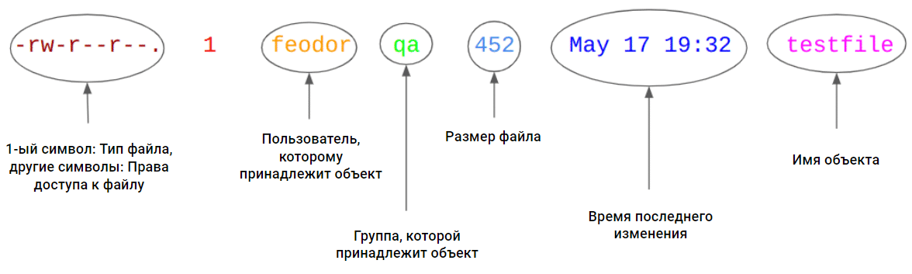

+ '-' для типичных файлов
+ 'd' для каталогов
+ 'l' для символических ссылок, объясненных в предыдущем уроке.
+ Другие: s, p, c, b - для специальных целей, вне рамок темы.
+ И 9 следующих символов, таких как "rw-r--r--" - это разрешения доступа к файлам UNIX

### Анатомия разрешений на доступ к файлам
Представьте, что у нас есть разрешения "rwxrwxrwx", установленные на каталог.
Это можно разделить и объяснить следующим образом:

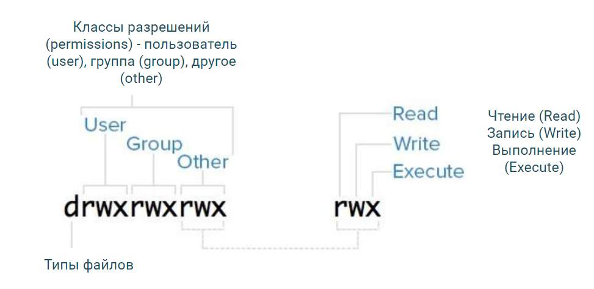

Что касается примера, показанного выше:
```commandline
[feodor@c7-sandbox ~]$ ls -l testfile
-rw-r--r--.   1    feodor   qa    452    May 17 19:32    testfile
```
Мы можем сказать, что ('-' означает "не разрешено"):
+ Пользователь (User): разрешения владельца файла (feodor) - 'rw'.
+ Группа (Group): разрешения группы (qa) - 'r'.
+ Другие (Other): разрешения других пользователей, т.е. не являющихся ни владельцами, ни входящих в группу владельцев, также равны 'r'.

```text
Как проверяются и применяются разрешения доступа:

Во-первых: является ли пользователь владельцем данного объекта? Если да - проверить, разрешают ли разрешения владельца объекта эту операцию.
Если пользователь не является владельцем объекта - является ли он членом группы? Если да - проверить, разрешают ли групповые разрешения объекта эту операцию.
Если пользователь не входит в группу - проверить, разрешают ли разрешения других на эту операцию.
```

## Смысл и формат записи прав доступа
| Бит                        | Значение для файлов                                                                                              | Значение для директорий                                                                                                                                                                                                                                                                                                                                                                     |
|----------------------------|------------------------------------------------------------------------------------------------------------------|---------------------------------------------------------------------------------------------------------------------------------------------------------------------------------------------------------------------------------------------------------------------------------------------------------------------------------------------------------------------------------------------|
| r - read (чтение)          | Файл может быть прочитан, например, с помощью cat, less, head, других инструментов.                              | Список содержимого каталога может быть прочитан. Если бит 'x' не установлен, могут быть прочитаны только имена объектов.                                                                                                                                                                                                                                                                    |
| w - write (запись)         | Содержимое файла может быть изменено. Но сам файл не может быть удален - см. 'w' для каталогов.                  | Любой элемент этого каталога может быть создан или удален. То есть, даже если вы не являетесь владельцем файла в этом каталоге, вы можете удалить его, установив 'w' для каталога. Это можно сделать только в том случае, если бит "x" также установлен.                                                                                                                                    |
| x - execute (выполнение)   | Файл может быть выполнен. Фактически исполняемые файлы: двоичные файлы и скрипты                                 | Самый важный бит для каталогов. Вы можете войти в этот каталог (например, с помощью "cd") и получить доступ (чтение, запись, выполнение) ко всему его содержимому, если это разрешено их правами доступа. Если у вас нет 'x' для каталога, вы НЕ можете:- переходить в подкаталоги - создавать/удалять объекты (файлы, каталоги) - читать информацию об объекте (разрешения, владелец, ...) |                                                                                                                                                                                                                                  |

### Восьмеричные числа
Биты доступа (r, w, x) также могут быть записаны в виде восьмеричных чисел, т.е.:
+ 'r' равно 4 (100)
+ 'w' равно 2 (010)
+ 'x' равно 1 (001)
+ '-' равно 0 (000)

все их комбинации являются суммами этих чисел, например.
+ 'r-x' равно 5 (101)
+ 'rw-' равно 6 (110)
+ 'rwx' равно 7 (111)

### Команды для изменения разрешений доступа к файлам
Существует 3 известные команды для работы с владельцами объектов, группами и разрешениями доступа:
```commandline
chown (ИЗМЕНИТЬ ВЛАДЕЛЬЦА): для установки нового владельца и/или группы для объекта
chgrp (ИЗМЕНИТЬ ГРУППУ): то же самое, но только для группы
chmod (ИЗМЕНИТЬ РЕЖИМ): установить новые разрешения доступа к файлу
```

### *chown*
```commandline
# Создаём файл, проверяем его владельца и группу
touch ~/chown.me
ls -l ~/chown.me

# Следующую команду можно выполнить только от пользователя root
chown operator:bin ~/chown.me

# Следующую команду можно выполнить только от члена группы "users"
chown :users ~/chown.me

# С опцией "-R" команда будет применена ко всей директории HOME:
chown -R :users ~
```

### *chgrp*
```commandline
# Следующие команды приведут к идентичному результату
chown :users ~/chown.me
chgrp users ~/chown.me

# chgrp поддерживает рекурсивный режим "-R"
chgrp -R users ~
```

### *chmod*
```commandline
# Создаём 2 объекта
mkdir ~/chmod.me.dir
touch ~/chmod.me.file

# Определяем права доступа
# Установим "rwxr-x--x", т.е. 751, на указанную директорию:
chmod 751 ~/chmod.me.dir

# Добавляем "r"-бит для прочих (others) и "w" для группы:
chmod g+w,o+r ~/chmod.me.dir

# Разрешаем владельцу делать что угодно с файлом
# Добавляем права на запись группе
# Отбираем права на чтение у прочих (others)
chmod u=rwx,g+w,o-r ~/chmod.me.dir

# Меняем права доступа для всего каталога
# Отнимаем все права у группы и прочих (others):
chmod -R go-rwx ~/chmod.me.dir
```

### Типичные ошибки при работе с разрешениями доступа к файлам
+ 777 к файлам или каталогам. Это широко распространено в плохо написанных интернет-руководствах, представляющих "chmod 777" как универсальный способ для решения всех проблем, связанных с правами доступа. Никогда не делайте этого, если вы точно не знаете, что делаете. Установка этого параметра без четкого понимания определенно подвергнет этот объект высокому риску быть произвольно измененным, удаленным и (для конфиденциальных данных) прочитанным любым пользователем и процессом системы и продемонстрирует вашу неспособность правильно работать с UNIX-подобными операционными системами, что часто приводит к отзыву доступа и другим личным проблемам.
+ chmod -R 777 /some/where - еще хуже, чем просто chmod 777, так как все объекты внутри этого каталога будут подвергнуты риску.
+ Непонимание прав доступа к каталогам и их значения.
+ Игнорирование прав доступа к каталогам при попытке получить доступ к вложенным файлам.

Символические ссылки всегда имеют разрешения 777, но это ничего не значит, поскольку фактические разрешения доступа такие же, как у целевого объекта:
```commandline
lrwxrwxrwx. 1 root root 7 янв 1 21:12 /bin -> /usr/bin
dr-xr-xr-x. 2 root root 36864 фев 19 13:31 /usr/bin
```

+ Ее содержимое не может быть изменено, она может быть только пересоздана.
+ Только владелец директории (для '/' это "root") может пересоздать ее.
+ Разрешения доступа к символической ссылке не влияют на разрешения доступа к целевому объекту (в соответствии с  замыслом).

## Исполняемые файлы
*PATH - это переменная оболочки (shell variable), которая содержит список каталогов для поиска исполняемых файлов. Она может быть отображена так же, как и другие переменные shell, упомянутые в предыдущих главах (например, USER и HOME), т.е. простой командой "echo":*
```commandline
localhost:~# echo $PATH
/usr/local/sbin:/usr/local/bin:/usr/sbin:/usr/bin:/sbin:/bin
```

"which” это команда для показа расположения исполняемого файла в каталогах PATH:
```commandline
localhost:~# which uname
/bin/uname
```

"uname" с опцией "-a", чтобы увидеть расширенную информацию об нашей системе:
```commandline
localhost:~# uname -a
Linux localhost 4.12.0-rc6-g48ec1f0-dirty #21 Fri Aug 4 21:02:28 CEST 2017 i586 Linux
```
*Но на самом деле, когда пользователь хочет, чтобы командная оболочка выполнила команду "uname", вызывается соответствующий исполняемый файл (/bin/uname в данном случае). Поэтому предыдущий пункт можно выполнить и указав полный путь, как показано ниже.*
```commandline
localhost:~# /bin/uname -a
Linux localhost 4.12.0-rc6-g48ec1f0-dirty #21 Fri Aug 4 21:02:28 CEST 2017 i586 Linux
```

### Пример
*создадим новый исполняемый файл (на самом деле, простой shell-скрипт) в текущей рабочей директории. Этот файл будет содержать только одну строку, "uname -a".*
```commandline
localhost:~# pwd
/root
localhost:~# echo "uname -a" > executable
localhost:~# chmod 755 executable
localhost:~# ls -lF executable
-rwxr-xr-x 1 root root 9 Jan 20 20:29 executable*
```

*когда командной оболочке предоставляется исполняемый файл без полного пути к нему (например, "uname" вместо "/bin/uname"), командная оболочка пытается найти его в директориях PATH. Если ничего не найдено (так как этот файл находится в директории /root, а директория "/root" не указана в PATH), выдается соответствующая ошибка:*
```commandline
localhost:~# executable
sh: executable: not found
```

*Когда в терминале UNIX выполняется продолжительная команда, можно:*
+ Она изначально может быть запущена как фоновая задача с помощью оператора "&".
+ Можно приостановить ее нажатием Ctrl+Z, а затем для продолжения выполнения использовать встроенные модули "fg" или "bg".
+ Если команда запущена, но больше не нужна, ее можно остановить, нажав Ctrl+C.

### Запуск и остановка команд
Выполните команду, затем нажмите Ctrl+Z, и оболочка покажет, что эта команда была приостановлена (не завершена):
```commandline
localhost:~# sleep 1000
^Z
[1]+ Stopped sleep 1000
```

Выполнив команду "jobs" (это встроенная команда оболочки), вы увидите все задания оболочки с их идентификаторами и статусами
```commandline
localhost:~# jobs
[1]+ Stopped sleep 1000
```

Теперь выполнение команды "sleep" остановлено, но его можно возобновить, вызвав команду "bg" с %ID задачи, которую нужно возобновить. Указанная задача будет отправлена на фоновое выполнение.
```commandline
localhost:~# bg %1
[1]+ sleep 1000 &
```

Теперь "jobs" отображает команду "sleep" как запущенную:
```commandline
localhost:~# jobs
[1]+ Running sleep 1000 &
```

Чтобы избежать этих манипуляций, иногда проще выполнить длительную команду в фоновом режиме с самого начала через оператор "&" в конце строки.  Оболочка отображает внутренний идентификатор этой задачи в квадратных скобках, здесь это [2].
```commandline
localhost:~# sleep 2000 &
[2] 157
```

Теперь есть 2 задачи текущих сеансов оболочки, обе выполняются:
```commandline
localhost:~# jobs
[1]- Running sleep 1000 &
[2]+ Running sleep 2000 &
```

Команды также могут быть переведены на передний план с помощью встроенной оболочки "fg". Здесь на передний план была помещена первая команда "sleep". Затем она была завершена нажатием Ctrl+C:
```commandline
localhost:~# fg %1
sleep 1000
^C
```

После завершения первой задачи остается только вторая:
```commandline
localhost:~# jobs
[2]+ Running sleep 2000 &
```

Любая задача оболочки может быть завершена командой "kill" (может существовать как исполняемый файл или встроенный в оболочку) с указанием ее %ID. После этого никаких задач не останется.
```commandline
localhost:~# kill %2
[2]+ Terminated sleep 2000
localhost:~# jobs
localhost:~#
```

### "Алиас" (псевдоним)
Это определенное пользователем имя существующей команды (и, возможно, ее опций). Если "b" является псевдонимом для "a --option1 --option2", то когда оболочке входа в систему предлагается выполнить "b --some-options arguments", на самом деле вместо этого будет выполнено "a --option1 --option2 --some-options arguments". Часто система Linux настроена так, что некоторые псевдонимы для всех пользователей доступны сразу же, например, "ll" (ls -l), "la" (ls -a).

Встроенная команда - это имя команды, которая поддерживается оболочкой входа в систему (/bin/bash является оболочкой входа в систему в большинстве случаев), но не существует в виде отдельного исполняемого файла. Примеры: cd, pwd, test - эти команды часто представлены в виде "настоящих" исполняемых файлов, но если это не так, оболочка входа в систему может выполнить соответствующие действия и сама.

По умолчанию какие-либо псевдонимы могут отсутствовать.
Пользователи могут определять свои собственные псевдонимы и переменные оболочки в файлах ~/.bashrc и(или) ~/.bash_profile, поэтому хорошей идеей будет добавить туда новую строку с определением псевдонима.
```commandline
localhost:~# echo "alias lf='ls -lF'" >> ~/.bashrc
```

Давайте проверим, задействована ли новая конфигурация. Мы видим новый псевдоним, значит, всё работает отлично. Напоминаем, что псевдоним не является исполняемым файлом и его путь нельзя выяснить с помощью команды.
```commandline
localhost:~# alias
alias lf='ls -lF'
localhost:~# which lf
localhost:~#
```

Если псевдоним более не нужен, можно "приказать" оболочке "забыть" о нем с помощью встроенной команды unalias:
```commandline
localhost:~# unalias lf
localhost:~# lf /etc/passwd
bash: lf: command not found
```

## Процессы и сигналы
Процесс операционной системы (ОС) — это экземпляр исполняемой программы, выполняемый системой в настоящее время. Это означает, что если программа заканчивает свою работу или завершается пользователем, то процесс также прекращает своё существование.

*Каждый процесс имеет несколько следующих основных атрибутов:*
+ PID - идентификатор процесса. Уникален для каждого выполняющегося процесса. То есть в каждый момент времени все процессы имеют различные идентификаторы PID. При повторном запуске той же программы соответствующие создаваемые процессы будут обладать новыми PID.
+ PPID — родительский идентификатор (PID). Процессы не возникают сами по себе, они создаются другими процессами. Таким образом, PPID - это PID родительского процесса.
+ А кто запускает самый первый процесс? «Главный» системный процесс называется init или systemd и обладает PID = 1, PPID = 0. Он создаётся ядром операционной системы при её загрузке.

+ Пользователь и группа, запустившие программу.
+ Название.
+ Аргументы командной строки.
+ Управляющий терминал. Указывается для процессов, взаимодействующих с терминалом и (или) пользователями в диалоговом режиме. Например, командный интерпретатор bash, который обычно запускается при входе пользователя в систему, определённо взаимодействует с терминалом и пользователями, и поэтому у него есть управляющий терминал.

Типичный сервер на ОС Linux (и UNIX) содержит множество работающих процессов, выполняющих различные функции: обработка входящих сетевых запросов от конечных пользователей, обработка данных, запуск запланированных задач, отслеживание состояния системы, работа интерактивных командных оболочек (типа bash) для выполнения команд пользователей и т. д. Все эти функции, как правило, выполняются без вмешательства человека отдельными процессами, которые созданы для автоматической работы
Такая автоматизация возлагается на специальные процессы, называемые демонами (это страшное слово часто используется в мире UNIX).
Демоны — это особый вид процессов (введите «man 7 daemon» в командном интерпретаторе, чтобы узнать больше).

«Настоящий» процесс-демон обладает следующими свойствами:

+ PPID = 1
+ Управляющий терминал отсутствует
+ В большинстве случаев текущей рабочей директорией демона является "/".


Существует несколько часто используемых инструментов и способов получения информации обо всех или конкретных запущенных процессах:
+ ps — основной инструмент для отображения списка запущенных процессов
+ top - инструмент для отслеживания запущенных процессов в реальном времени, аналог диспетчера задач Windows и мониторинга системы macOS
+ pgrep - инструмент для поиска процессов по их названию или аргументам
+ pstree - инструмент для отображения процессов в виде дерева. Полезен для изучения работы приложений
+ В псевдо-каталоге /proc/PID содержится много подробных сведений о процессе с идентификатором PID. Очень полезен в некоторых случаях


## Как искать процессы и просматривать их списки

### *Команда ps*
ps — основной инструмент для отображения списка запущенных процессов
Отображает список процессов, работающих в текущий момент времени, а затем завершает свою работу. Самые полезные ее опции следующие:
+ -e для отображения всех процессов всех пользователей. По умолчанию показываются процессы только текущего пользователя.
+ -f для вывода расширенных сведений о каждом процессе. По умолчанию отображается только ограниченный объём информации.
+ -u username для отображения процессов, запущенных пользователем c данным именем (username).
+ -p PID - для вывода сведений об процессе с данным PID
+ -o поле1, поле2,... - для вывода определённых сведений о процессах (см. подробное руководство с помощью команды man ps).
```commandline
Пример
ps -ef
покажет запущенные процессы с расширенными сведениями

ps -fu $USER
покажет процессы текущего пользователя
```
Значение каждого столбца следующее:

+ UID: имя пользователя, запустившего процесс
+ PID: идентификатор процесса
+ PPID: идентификатор родительского процесса
+ C: не имеет значения и не показывается в выводе команды ps на эмуляторе
+ STIME: время запуска процесса. Не показывается на эмуляторе
+ TTY или TT: управляющий терминал. Знак «?» показывается для процессов, не связанных с терминалом (таких как демоны)
+ TIME: суммарное процессорное время выполнения
+ CMD: команда с аргументами. Может включать полный путь к исполняемому файлу процесса, но это не гарантировано. Если название процесса показано в квадратных скобках, значит, этот процесс является частью ядра ОС.

У команды ps есть интересная опция --forest, служащая для отображения процессов в виде дерева аналогично команде pstree. Отображаются родительские процессы и их дочерние процессы, наглядно показывая связи между ними.
```commandline
ps -e -o uid,pid,ppid,stime,tty,time,args --forest
```
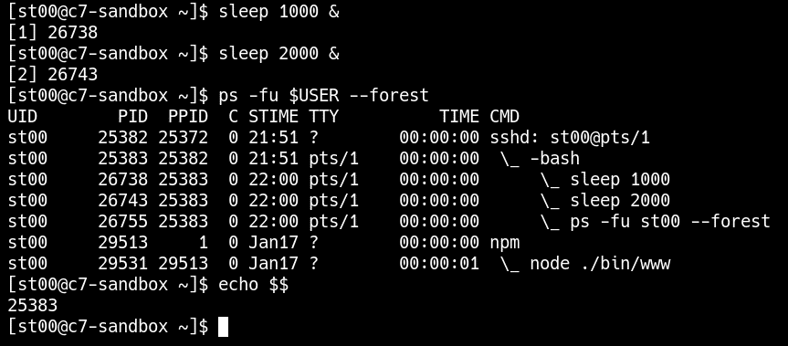

Итак, что именно показано на этом снимке экрана и как это следует интерпретировать:

+ Первое: пользователь запускает два процесса программы sleep в фоновом режиме. Их идентификаторы PID: 26738 и 26743
+ Затем запускается команда ps с нужными аргументами.
+ Первый процесс в отображаемом этой командой списке — sshd с PID = 25382. Он отвечает за удалённый вход в систему: текущий пользователь st00 вошёл в систему посредством сессии SSH.
+ Процесс оболочки bash с PID = 25383 является дочерним для процесса sshd. В действительности это стартовая командная оболочка, запущенная процессом sshd после успешного входа в систему.
+ Ниже отображаются два процесса sleep, являющиеся дочерними для процесса bash.  Посмотрите на их идентификаторы PID, они совпадают с идентификаторами, показанными оболочкой (см. п. 1).
+ Сама программа ps запущена процессом bash, то есть является его дочерним процессом.
+ Ниже отображаются процессы "npm" и "node". Процесс "npm" с PID=28513, скорее всего, является демоном, так как его PPID=1, а TTY="?".
+ Последняя команда "echo $$" - это трюк для получения PID текущей оболочки входа в систему. "$" - это переменная оболочки для хранения значения PID, поэтому "$$" = 25383, это то же самое, что показано в п.4.

## *Команда pgrep*
Она помогает быстро найти процесс (или процессы), используя логику, аналогичную инструменту "egrep":
+ -f: для поиска в полной командной строке (т.е. как имена команд, так и аргументы). По умолчанию проверяются только имена команд
+ -a: для вывода списка всей командной строки, а не только PID.

```commandline
Пример
pgrep -fa apache2
```

### *Псевдо-директория /proc*
+ Это виртуальная файловая система, содержащая множество сведений о работающих процессах.  Её называют псевдо-файловой системой, так как в реальности на диске нет файлов, расположенных в директории /proc. Вместо этого ядро операционной системы отображает информацию в виде файлов и директорий в директории /proc.
+ Все команды, относящиеся к процессам, такие как ps, pstree, pgrep, берут информацию из директории /proc.
+ Можно получить информацию о ваших процессах напрямую из директории /proc
+ Чтобы узнать точный путь к исполняемому файлу и (или) текущую рабочую директорию, можно напрямую обратиться к директории /proc.

### *Отслеживание процессов и команда top*
Команда top выводит в реальном времени сведения о работающих процессах и текущую нагрузку на систему (центральный процессор, память, задачи), а также позволяет отправлять процессам сигналы и завершать их работу. 
В отличие от ps, команда top работает, пока пользователь не остановит её, и показывает объём используемых системных ресурсов в реальном времени.
Она обновляет экран каждые несколько секунд.
Этот инструмент очень полезен для выполнения следующих действий:

+ Поиск процессов, которые больше других потребляют ресурсы процессора и памяти.
+ Определение текущей загрузки системы.

*Основные горячие клавиши для программы top:*
+ q - выход из программы (quit)
+ 1 (один) — отображение или скрытие сведений о загрузке процессора.
+ P — упорядочивание процессов согласно использованию ресурсов процессора (режим по умолчанию).
+ M — упорядочивание процессов согласно использованию ресурсов памяти.
+ E — отображение сведений об использовании памяти не в КБ, а в МБ (единичная E) или ГБ (нажмите E дважды).
+ k — отправка сигнала процессу (нажмите Esc, если вы уже начали отправку сигнала, но затем передумали).

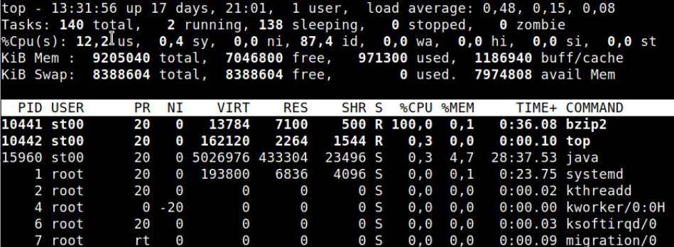

Самые полезные поля в выводе (над белой строкой):

+ 1-я строка: время работы (uptime; как долго уже работает компьютер) и средняя загрузка (load average).
+ 2-я строка: количество задач всего (total) и работающих (running).
+ 3-я строка: показывает текущую нагрузку на все процессоры (CPU):
  + us и sy — время процессора, используемое процессами пользователей и процессами операционной системы соответственно. В сумме с "wa" (показано ниже) дает общую нагрузку на систему.
  + id — время простоя в %; 100 означает, что система полностью свободна, 0 означает, что система полностью занята.
  + wa — время ожидания процессором медленного ввода-вывода. Высокое значение wa означает проблемы с нагрузкой на диск или иногда проблемы с сетью.
  + Примечание: 100 % означает, что ваш компьютер полностью загружен. Например, 50 % для 8-ядерного процессора может означать полную загрузку 4-х ядер.
+ 4-я строка: оперативная память (Mem) в килобайтах.
  + Самое полезное поле здесь это total, суммарный размер оперативной памяти (ОЗУ, RAM).
  + Остальные поля этой строки не так важны.
+ 5-я строка: память подкачки (swap), то есть виртуальная оперативная память, в реальности располагающаяся на диске. Также в килобайтах:
  + Поле total — текущий размер памяти подкачки (swap size).
  + Поле free — размер свободной памяти подкачки (swap size).
  + Поле avail Mem — самое информативное. Показывает, как много ОЗУ (RAM) может быть использовано приложениями, если им потребуется больше памяти.

Информация о процессах (ниже белой строки), полезные поля:

+ %CPU: % использования одного ядра процессом. 200 % означает полную загрузку процессом двух ядер.
+ %MEM: % всей ОЗУ, используемой процессом.
+ PID, USER, COMMAND: аналогично команде ps.

## Сигналы
Сигнал — это короткое сообщение, которое можно отправить процессу.
Сигналы представляют самый простой вариант взаимодействия между процессами (inter-process communication — IPC)

Чтобы отправить сигнал ЧТО (например, TERM, KILL, STOP и т. д.) процессу с идентификатором PID:
```commandline
kill [-ЧТО] PID
[-ЧТО] означает номер или название сигнала, эта опция необязательна, по умолчанию отправляется сигнал TERM. 
```

*Например, чтобы завершить процесс самым "жёстким" способом без возможности корректного завершения своей работы, можно использовать следующую команду:*
```commandline
kill -KILL PID
или
kill -9 PID
```

*Для отправки одного и того же сигнала нескольким процессам с одинаковым названием удобно применять команду killall:*
```commandline
killall [-ЧТО] [другие опции] название_процесса
```

*Для отправки одного и того же сигнала нескольким процессам, названия которых отвечают некоторым условиям, используется команда pkill.  Она похожа на команду pgrep, но отправляет сигнал ЧТО процессам, названия которых (и аргументы, если указана опция -f) соответствуют шаблону*
```commandline
pkill [-ЧТО][другие опции] название_процесса
```

### *Важные замечания о сигналах:*
+ Обычные пользователи могут отправлять сигналы только своим процессам.
+ root может отправлять сигналы всем.
+ Следует помнить: команда kill НЕ просто завершает процессы! Она отправляет сигналы.

*Поиск процессов на основе их названий, или аргументов, или других условий и отправка им сигнала.*
```commandline
ps -ef | egrep […опции…]
(в первой команде узнаем PID-ы интересующих процессов)

kill -ЧТО КАКОЙ-ТО_PID
```

*Принудительное завершение текущего сеанса оболочки без применения команд logout и exit. $$ означает идентификатор PID текущей оболочки.*
Примечание: в реальных системах Linux выполнение этой команды приведёт к потере всей истории команд текущего сеанса (она не будет сохранена в истории оболочки).
```commandline
kill -9 $$
```

*Отправка сигнала TERM всем процессам с названием java.*
```commandline
killall java
```

*Отправка сигнала TERM всем процессам, в названиях или аргументах которых содержится последовательность символов «slee» и которые запущены текущим пользователем (см. опцию -u). Конечно, будут затронуты и все процессы sleep.*
```commandline
pkill -u $USER -f slee
```

*Самые полезные сигналы (используемые на месте ЧТО) с указанием их имен и номеров:*
+ TERM (15), terminate — завершить: отправляется по умолчанию. Означает «мягкое» завершение работы процесса: вначале удаляются все временные файлы, закрываются все открытые файлы и т. д., а затем завершается работа.
+ KILL (9), kill — уничтожить: безусловное завершение работы процесса.
+ INT (2), interrupt — прервать: отправляется, когда пользователь нажимает клавиши Ctrl+C. В большинстве случаев завершает работу соответствующего процесса.
+ TSTP (20), terminal (TTY) stop — остановка посредством терминала: отправляется, когда пользователь нажимает клавиши Ctrl+Z. Предназначен для процессов, работающих в интерактивном режиме. Приостанавливает выполнение процесса.
+ STOP (19), stop — остановить: приостанавливает работу процесса аналогично TSTP, но может использоваться для любых процессов, включая демонов. Так же, как и сигнал KILL, не может быть проигноирован процессом.
+ CONT (18), continue — продолжить: отправляется, когда пользователь выполняет команду fg или bg с целью снова запустить работу процесса. Работу всех процессов, остановленных с помощью сигнала STOP, можно возобновить сигналом CONT.


## Службы (services) Linux
Служба Linux может быть представлена как "обертка" для лучшего управления приложениями. Когда приложение управляется как сервис, а не как список разрозненных процессов, гораздо проще запускать, останавливать, перезапускать, получать текущее состояние и настраивать его поведение в зависимости от событий ОС.
Служба — это некая сущность, выполняющая конкретную работу. Обычно к службам относятся серверные приложения, такие как веб-серверы Apache и Nginx, серверы баз данных, почтовые серверы и т. д.
*Проще говоря: когда пользователи запускают программу, они отвечают на вопрос "ЧТО должно быть выполнено". Сервис, построенный вокруг той же программы, отвечает на вопрос "КАК именно следует управлять этой программой"*

### Знакомство с systemd
это большой комплект программного обеспечения (ПО), ответственный за инициализацию системы и управление службами.

Systemd оперирует следующими объектами, называемыми "юнитами":
+ Службы (services) — обычно это серверное ПО, такое как веб-сервер Apache, серверы баз данных, почтовые серверы и т. д.
+ Цели (targets) — группы других юнитов (служб и т. д.), которые необходимо запускать совместно (например, в ходе запуска системы).
+ Другие (сокеты, таймеры…)

*Для настройки и отслеживания служб можно использовать следующие инструменты:*
+ Службы, добавленные к systemd вместе с их настройками (известными также как юнит-файлы), находятся в директории /etc/systemd/system и ее вложенных директориях. Обычно юнит-файлы представляют собой символьные ссылки на «настоящие» файлы, расположенные в директории /usr/lib/systemd/system.
+ Службы (service), уже «известные» systemd, а также их состояние можно просмотреть с помощью следующей команды. Она отображает информацию аналогично командам man и less:
```commandline
systemctl list-units --type=service
```
+ Чтобы посмотреть только службы, которые запущены (running) в настоящий момент, можно использовать дополнительную опцию:
```commandline
systemctl list-units --type=service --state=running
```
+ Чтобы увидеть, какие службы были запущены в ходе загрузки ОС, выполните команду, показанную ниже. «Включённые» (enabled) службы запускаются вместе с ОС. «Выключенные» (disabled) службы — не запускаются. «Статические» (static) службы запускаются без условий, их нельзя включить или выключить, как другие.
```commandline
systemctl list-unit-files --type=service
```
+ Чтобы увидеть только включенные службы, выполните следующее:
```commandline
systemctl list-unit-files --type=service --state=enabled
```
+ Проверка текущего состояния службы с названием название_службы:
```commandline
systemctl status название_службы
```
+ Узнать текущее состояние службы, относящейся к конкретному процессу. Это самый простой способ соотнести процесс, имеющий известный идентификатор PID, с соответствующей службой:
```commandline
systemctl status PID_процесса
```
+ Запуск (start), остановка (stop) и перезапуск (restart) службы:
```commandline
systemctl start название_службы
systemctl stop название_службы
systemctl restart название_службы
```
+ Включение и отключение автоматического запуска службы на этапе загрузки ОС. Опция --now используется, чтобы добавить службу в автозагрузку и одновременно запустить её или исключить из автозагрузки и одновременно остановить (в зависимости от состояния службы):
```commandline
systemctl enable|disable [--now] название_службы
```
+ Узнать настройки автоматического запуска конкретной службы:
```commandline
systemctl is-enabled название_службы
```
+ Получить более подробные сведения для каждой службы
```commandline
systemctl status название_службы
```
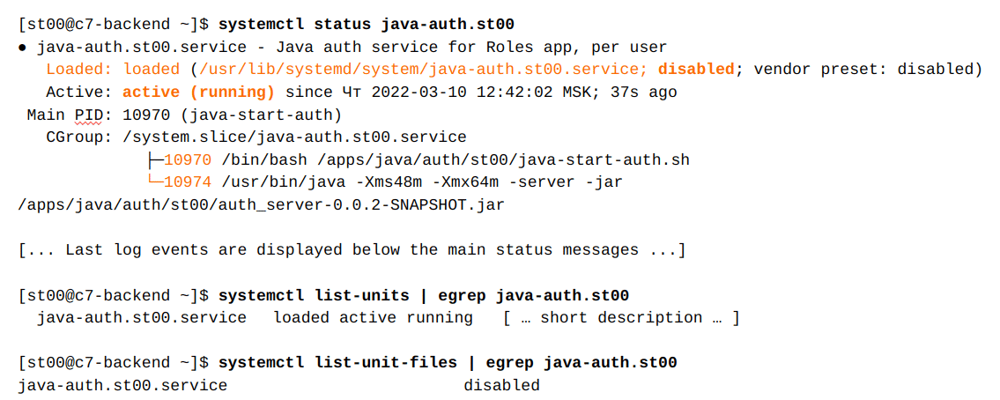

Значение выделенных полей описано ниже:

+ Loaded: loaded — загружены ли элементы службы в пул памяти systemd.
+ Путь к юнит-файлу службы: /usr/lib/systemd/system/java-auth.st00.service. Здесь хранятся все настройки службы.
+ Disabled: запускается ли служба в процессе загрузки ОС.
+ Active: active (running): текущее состояние службы
+ Список процессов (относящихся к этой службе) показан в виде дерева (10970, 10974).

### Journalctl: вывод журналов служб systemd
это инструмент для управления журналами служб systemd.
Для выполнения этой команды необходимы права root или включение в группу systemd-journal.

+ Просмотр всех записанных в журнал событий для службы название_службы. Данные журнала показываются так же, как и в случае с командами less и man, поэтому доступны все те же функции: поиск по шаблонам и т. п.
```commandline
journalctl -u service_name
```
+ То же самое, но с переходом к последним строкам журнала:
```commandline
journalctl  -e -u service_name
```
+ Отслеживание событий службы в реальном времени и вывод их на терминал, наподобие команды tail -f (нажмите Ctrl+C для выхода):
```commandline
journalctl -f -u service_name
```
+ Просмотр событий от нескольких служб одновременно. Эту функцию можно сочетать с другими опциями, например -f:
```commandline
journalctl -u service_name_1 -u service_name_2 ...
```


## Информация о системе и как её собирать
Узнать больше сведений о компьютере, включая имя узла.
```commandline
uname -a
```
*Выводится длинная строка вроде следующей:
Linux unixdell 5.15.0-58-generic #64~20.04.1-Ubuntu SMP Fri Jan 6 16:42:31 UTC 2023 x86_64 x86_64 x86_64 GNU/Linux
Где первое слово это название ОС (всегда Linux на машинах с ОС Linux), затем идёт имя узла, затем версия ядра и т. д.*

### CPU (процессоры)
Есть два способа получить сведения, касающиеся процессоров:

+ Запустить команду lscpu (лучший способ).
+ Просмотреть файл /proc/cpuinfo (запасной вариант, не очень удобный, но рабочий).

Собирая информацию о процессорах, следует помнить о нескольких аспектах:

+ Все современные процессоры являются многоядерными, то есть один физический процессор содержит несколько ядер. Большинством инструментов (например, top, упомянутым в предыдущей секции) они показываются как несколько процессоров.
+ Многопоточность (когда одно физическое ядро может обрабатывать два или более потоков выполнения) удваивает (утраивает и т. д.) число ядер, показываемое многими инструментами, наподобие top.
+ Одно ядро можно встретить только на очень небольших виртуальных машинах.
+ Что касается виртуальных машин, то отображаемая модель процессора может отличаться от модели физического процессора (например, какая-либо модель Intel или AMD), на котором работает эта машина. Но это зависит от технологии виртуализации в каждом конкретном случае.
+ С точки зрения производительности наиболее интересна следующая информация:
  + Архитектура, например x86_64, i586, ARM и т. д.
  + Модель процессора
  + Частота в МГц или ГГц
  + Количество ядер

Вкратце, каждое ядро — это по большей части независимый вычислительный блок внутри процессора, способный выполнять программы самостоятельно, без взаимодействия с другими ядрами. Поэтому каждое ядро операционная система воспринимает как отдельный процессор.

Потоки: для многопоточных ядер возможно одновременное выполнение более одного процесса на ядро. Это не означает, что одно многопоточное ядро имеет такую же производительность, как два однопоточных; на самом деле, этот показатель можно приблизительно оценить как 1,5. Он зависит от процессов (и их специфики), выполняемых на каждом ядре.

Тактовая частота процессора: чем больше значение частоты в МГц, тем быстрее выполняются инструкции процессора, что приводит к повышению производительности.

Для сбора самой интересной информации из вывода команды lscpu необходимо обратить внимание на следующие поля:
+ Architecture (архитектура): в большинстве современных устройств это x86_64, но могут встречаться и другие. Например: процессор с архитектурой ARM не может выполнять программы, написанные для x86_64.
+ CPU(s) (процессор): суммарное количество потоков = количество ЦП × кол-во ядер на разъём × кол-во потоков на ядро.
+ On-line CPU(s) list (список процессоров, отображаемый в реальном времени): какие ядра доступны в текущий момент; в большинстве случаев доступны все ядра. Номера процессоров начинаются с 0.
+ Thread(s) per core: (потоков на ядро): как говорилось выше, существуют однопоточные и многопоточные процессоры. Эти сведения указываются в этом поле.
+ Core(s) per socket: (ядер на разъём): количество ядер у каждого процессора.
+ Socket(s): (разъёмы): количество процессоров (не ядер), установленных на компьютере. Для бытовых устройств, таких как настольные персональные компьютеры, ноутбуки и т. д., этот параметр почти всегда равен 1. Для мощных серверов этот параметр, как правило, превышает 1.
+ Vendor ID, Model name (идентификатор производителя, название модели): описывает модель процессора.
+ CPU MHz: (частота процессора в МГц): частота, которая может динамически варьироваться

Изучая вывод команды top, нужно обратить внимание на следующие нежелательные показатели:
+ Постоянно высокие значения полей us, sy, ni означают, что компьютер находится под высокой нагрузкой.
+ Постоянно высокое значение поля wa означает недостаточную производительность подсистемы ввода-вывода, представляемой, как правило, жёстким диском. Так что высокие значения wa не означают проблемы со слабым процессором, скорее, требуются действия с хранилищем.

### Оперативная память
Чем больше у вас памяти, тем больше приложений вы можете запустить одновременно без негативных последствий. Кроме того, многие серверные приложения используют память довольно интенсивно, так что можно сказать, что памяти почти всегда недостаточно.

В современных операционных системах используется два типа памяти:

+ RAM (ОЗУ, оперативное запоминающее устройство): это «настоящая» память.
+ Swap (память подкачки): память на диске, обычно используемая для выгрузки на диск неактивных приложений, когда ОЗУ заполнено. Она намного медленнее по сравнению с ОЗУ, поэтому если память подкачки активно используется, то работа компьютера будет также значительно замедленна. Такая же память есть и в Windows.

Объём памяти показывается командой:
```commandline
free
в килобайтах (по умолчанию)
```
Опция "-m" — для отображения в МБ. Команда free показывает общий и свободный объём как для ОЗУ, так и для памяти подкачки.

Самые интересные поля:

+ Mem (ОЗУ): total (всего) и available (доступно; то есть сколько ещё памяти доступно для приложений).
+ Swap (память подкачки): если часто используется (то есть поле used (используется) > 0), администраторам стоит задуматься об увеличении оперативной памяти.

### Другие параметры: lsblk, lsusb, lspci
В некоторых случаях также полезно собрать информацию о следующих устройствах:
+ дисковые устройства (внутренние и внешние, такие как подключённые USB-устройства флэш-памяти) — используйте команду lsblk;
+ устройства PCI, такие как сетевые интерфейсы, контроллеры Wi-Fi, видеокарты — используйте команду lspci;
+ периферийные устройства, обычно подключаемые к порту USB — запустите команду lsusb.

## Файловые системы
Каждая файловая система ОС Linux подключена к определённому месту главного «дерева» иерархии файлов и директорий. Действие по подключению файловой системы к надлежащему месту дерева называется монтированием (mounting), это специальное место называется точкой монтирования (точкой подключения, mounting point).
```commandline
mount
```

С помощью команды mount (mount — англ., монтировать, устанавливать) можно посмотреть, как физические (и виртуальные) устройства подключены к своим точкам монтирования (каждая точка монтирования — это существующая директория).
```commandline
ПРИМЕР

[st00@c7-sandbox ~]$ mount | egrep -v tmpfs | egrep /dev 
devpts on /dev/pts type devpts (rw,nosuid,noexec,relatime,seclabel,gid=5,mode=620,ptmxmode=000)
cgroup on /sys/fs/cgroup/devices type cgroup (rw,nosuid,nodev,noexec,relatime,seclabel,devices)
/dev/mapper/rootvg-rootlv on / type ext4 (rw,relatime,seclabel,data=ordered)
mqueue on /dev/mqueue type mqueue (rw,relatime,seclabel)
hugetlbfs on /dev/hugepages type hugetlbfs (rw,relatime,seclabel)
/dev/sda1 on /boot type ext4 (rw,relatime,seclabel,data=ordered)
/dev/mapper/rootvg-tmplv on /tmp type ext2 (rw,relatime,seclabel)
/dev/mapper/rootvg-homelv on /home type ext4 (rw,relatime,seclabel,quota,usrquota,grpquota,data=ordered)
```
*Третье «слово» каждой строки содержит соответствующую точку подключения, например /, /boot, /tmp, /home. То есть главная файловая система "/" подключена из устройства /dev/mapper/rootvg-rootlv, файловая система /boot располагается на устройстве /dev/sda1 и т. д.*

В нашем случае:
+ Файловая система с домашними директориями /home хранится на отдельном устройстве. Поэтому, даже если пользователи полностью исчерпают место на /home, сама операционная система будет в безопасности, так как переполнение не затронет её главную файловую систему (т. е. /).
+ То же касается и файловой системы /tmp, которая также часто подключается как отдельная.

### df
*Команда df ещё даже интереснее команды mount с точки зрения повседневной работы, поскольку она показывает использование дискового пространства для всех подключённых файловых систем. Поэтому если в вашей системе закончилось свободное дисковое пространство и вы получили сообщение «No space left on device» (не осталось свободного места на устройстве), то первое, что нужно запустить, это команду df.*

Стоит только упомянуть об опции -m (для использования мегабайтов) и -h (для удобного для человека формата вывода).
```commandline
ПРИМЕР

[st00@c7-sandbox ~]$ df -m | egrep -v tmpfs
Filesystem                1M-blocks  Used Available Use% Mounted on
/dev/mapper/rootvg-rootlv     22047  9515     11493  46% /
/dev/sda1                       488   246       207  55% /boot
/dev/mapper/rootvg-tmplv       4032    58      3770   2% /tmp
/dev/mapper/rootvg-homelv     25071  4409     19535  19% /home
```
*В показанном выше примере вывод команды mount очищен от ненужных в нашем случае строк, относящихся к виртуальным файловым системам tmpfs. Как мы видим, в главной файловой системе "/" есть ещё 11 ГБ свободного (Available) пространства, в /home — 19 ГБ и т. д.*
Если в файловой системе закончится место, то будут показаны сообщения об ошибках *No space left on device*

Но сообщение об ошибке «No space left on device» может быть показано, даже когда в файловой системе ещё много свободного места.
```commandline
ПРИМЕР

[st00@c7-backend shared]$ touch /mnt/testfs/shared/new.empty.file
touch: cannot touch '/mnt/testfs/shared/new.empty.file': No space left on device

[st00@c7-backend shared]$ df -h /mnt/testfs/shared
Filesystem      Size  Used Avail Use% Mounted on
/dev/loop0       93M  2.5M   84M   3% /mnt/testfs
```

Обычно в таких случаях только системные администраторы или DevOps-инженеры могут сказать, что произошло. И, скорее всего, причина будет в inode.
А что такое inode? Если коротко: для каждого файла и директории в файловой системе есть специальная отдельная запись, называемая индексным дескриптором, или inode (index node), в которой хранятся настройки прав доступа, указан владелец-пользователь и группа-владелец и другая служебная информация, называемая метаданными и метаинформацией. 

Для каждого файла и каталога необходим свой дескриптор.

Для каждого дескриптора требуется немного дискового пространства, поэтому в файловой системе может быть только ограниченное количество дескрипторов, устанавливаемое в момент создания файловой системы (создание файловой системы — это то же самое, что и форматирование диска в ОС Windows). Когда индексные дескрипторы заканчиваются, в файловой системе уже больше нельзя создавать новые объекты, и поэтому выводится сообщение об ошибке «No space left on device».

Понимая суть индексных дескрипторов, можно легко выявить причину проблемы с помощью команды df с опцией -i, означающей отображение дескрипторов inode, вместо дискового пространства:
```commandline
[st00@c7-backend shared]$ df -i /mnt/testfs
Filesystem     Inodes IUsed IFree IUse% Mounted on
/dev/loop0      25688 25688     0  100% /mnt/testfs
```
*Теперь первопричина ошибки ясна — все индексные дескрипторы уже используются (IUse% = 100 %) для существующих файлов и директорий. Такое может произойти при создании большого количества небольших файлов, например, из-за сбоя приложения или логических ошибок.*

### du
*В отличие от mount и df, эта команда не относится напрямую к файловым системам. Она подсчитывает размер директорий.*
*Для этого используется опция "-s". Также ее лучше комбинировать с опциями "-m" (показывать объем в МБ) или "-h" (размер в понятном человеку формате).*
```commandline
ПРИМЕР

[st00@c7-sandbox ~]$ du -sm ~ /tmp 2>/dev/null
174     /home/st00
1       /tmp

[st00@c7-sandbox ~]$ du -sh ~ /tmp 2>/dev/null
174M    /home/st00
800K    /tmp
```

Примечания:

+ -s означает summarize (суммировать, подводить итог), эта опция нужна, чтобы отображался только итоговый полный размера каталога. -h означает human-readable — понятный для человека.
+ Этот инструмент может посчитать размер только тех каталогов, для которых у вас есть права на чтение и выполнение, остальные будут проигнорированы с выводом сообщения об ошибке «Permission denied» (в доступе отказано).

## Архивы и сжатие
При выполнении операций сжатия с помощью gzip и bzip2 следует помнить о нескольких вещах:
+ gzip устанавливается везде, bzip2 является опциональным и может отсутствовать.
+ Они могут сжимать и распаковывать ТОЛЬКО отдельные файлы (НЕ каталоги).
+ Они могут читать ввод из stdin, т.е. действовать по принципу "что-то ... | gzip -9c > /some/where".
+ Входные файлы удаляются по умолчанию, если не указана опция "-c".
+ bzip2 сжимает лучше, чем gzip, но работает дольше.
+ Оба инструмента однопоточны, т.е. могут использовать только одно ядро процессора, а не все сразу.

Их наиболее полезные опции - общие для обоих:
+ -1...-9: степень сжатия от 1 до 9, где 1 - минимальная, 9 - максимальная.
+ -d: распаковать файл. Коэффициент сжатия здесь не требуется.
+ -с: вывести результат на stdout. Входные файлы не удаляются при использовании "-с".

Использование:
```commandline
Сжатие одного файла:

gzip -9 некий_файл

Файл, полученный на входе, удаляется, вместо него создаётся новый файл некий_файл.gz.
```

```commandline
Сжатие всех файлов *.txt в текущей директории:

gzip -9 *.txt

Все входные файлы удаляются, вместо них создаются новые файлы *.txt.gz
```

```commandline
Сжатие файла “некий_файл” и вывод результата в stdout

bzip2 -9c некий_файл > некий_файл.bz2

При работе с stdout входные файлы сохраняются
```

```commandline
Распаковка файла

bzip2 -d некий_файл .bz2

Входной файл "некий_файл.bz2" удаляется, вместо него создается "некий_файл"
```

```commandline
Распаковка с сохранением исходного файла:

gzip -dc некий_файл.gz > некий_файл

Входной файл "some_file.gz" сохраняется, так как указано "-c"
```

```commandline
Сжатие данных, поступающих из stdout другой команды:

cat *.log | bzip2 -5c > /tmp/compressed-logs.bz2

Когда эти инструменты сжатия читают входные данные из stdin через пайп, необходимо указать опцию "-c" и перенаправить их вывод в какой-либо файл; в противном случае он будет выведен в терминал (что нежелательно в большинстве ситуаций).
```

### tar
+ "tar" - это основной инструмент для создания архивов из нескольких файлов. То есть, имея на входе каталог, "tar" конкатенирует его содержимое в один файл.
+ "tar" также может создавать сжатые архивы за один раз, подобно инструменту Windows "zip".

В Windows обычные инструменты архивации, такие как zip, WinRAR, 7zip и т.д., берут папку или файл(ы) и сжимают их в архив. Вы получаете только один сжатый файл вместо многих.

В мире UNIX это работает по-другому:

+ Архив UNIX - это "склеенная" пара входных файлов и каталогов, не обязательно сжатая."tar" - основной инструмент для создания архивов.
+ Архив может быть сжат как во время, так и после его создания.
+ Для сжатия архивов могут использоваться внешние инструменты, такие как gzip и bzip2.

Основные советы для архивирования файлов в UNIX следующие:

+ Скопируйте все, что вам нужно, в отдельную, только что созданную директорию.
+ Сделайте архив этой директории. При необходимости, сожмите этот архив.
+ После извлечения где-нибудь в новой директории (или, что более вероятно, даже на другой машине), эта директория (см. шаг 2) будет хранить все исходные файлы внутри.

Наиболее полезными опциями программы "tar" являются:

+ -f /path/to/file.tar: имя входного или выходного файла
+ -с: создать архив
+ -t: вывести список его содержимого
+ -x: извлечь все объекты
+ -z: сжать архив с помощью gzip во время создания
+ -j: сжать архив с помощью bzip2 (если установлен) во время создания

```commandline
Создать архив директории можно следующим способом:

tar -c -f /путь/к/архиву.tar /некая/директория

Примечание: лучше указывать относительные пути или заранее перейти к директории /некая/директория с помощью cd, чтобы команда выглядела примерно следующим образом

tar -c -f /путь/к/архиву.tar dir
```

```commandline
Отобразить содержимое архива, то есть вывести имена файлов и директорий в стандартный поток вывода stdout:

tar -t -f /путь/к/архиву.tar
```

```commandline
Извлечь содержимое архива в текущую директорию:

tar -x -f /путь/к/архиву.tar
```

```commandline
Извлечь содержимое архива и поместить в другое место, НЕ в текущую директорию:

tar -x -f /путь/к/архиву.tar -C /новое/место

Содержимое архива будет распаковано и помещено в /новое/место. Это место должно существовать перед выполнением “tar -xf” 
```

```commandline
Архивировать каталог с помощью gzip:

tar -czf /путь/к/архиву.tar.gz некая_директория
```

```commandline
Архивировать каталог некий_каталог с помощью bzip2 (если bzip2 установлен):

tar -cjf /путь/к/архиву.tar.bz2 некая_директория
```

```commandline
Показать содержимое архива:

tar -tf /путь/к/архиву.tar.gz
или
tar -tzf /путь/к/архиву.tar.gz

Для версии tar, используемой в Linux, для извлечения или вывода содержимого опции -z и -j не нужны.
```

```commandline
Распаковать архив в текущую директорию:

tar -xf /путь/к/архиву.tar.bz2
или
tar -xjf /путь/к/архиву.tar.bz2

Для версии tar, используемой в Linux, для извлечения или вывода содержимого опции -z и -j не нужны.
```

```commandline
ПРИМЕР

# Архивирование директории с помощью gzip с использованием пайпов
tar -cf - /path/to/dir | gzip -9c > my-archive.tar.gz

# Архивирование директории с помощью bzip2 с использованием пайпов
tar -cf - /path/to/dir | bzip2 -9c > my-archive.tar.bz2

# Распаховка существующего архива с использованием пайпов
gzip -dc my-archive.tar.gz | tar -xf -
bzip2 -dc my-archive.tar.bz2 | tar -xf -
```

## Передача файлов между компьютерами с помощью протокола SCP  (Secure CoPy, или SSH CoPy)
```commandline
Отправка (т. е. загрузка) файла на компьютер с именем host, который можно указать как в виде IP-адреса, так и в виде доменного имени. Для сессии SSH и, соответственно, для отправки файла будет использоваться учётная запись someone:

scp некий_файл someone@host:/путь

В первую очередь, чтобы выполнить команду, необходимо ввести пароль для учётной записи someone. После выполнения команды этот файл появится на компьютере host в директории /путь (она обязана существовать). Название файла останется прежним (некий_файл).
```

```commandline
То же самое, но этот файл будет скопирован на компьютере host как
"/путь/другой_файл":

scp некий_файл someone@host:/путь/другой_файл

Если файл /путь/другой_файл уже существует, он будет  перезаписан содержимым файла некий_файл, так же, как и в случае с командой cp.

Помните, что перезапись целевого файла (если он существует на момент запуска команды) выполняется как при загрузке, так и при скачивании.
Важно: при перезаписи файлов никаких предупреждений не выводится. Для SCP нельзя задать поведение, аналогичное "cp -i".
```

```commandline
Для копирования всей директории со всем содержимым нужна опция "-r", так же как и для команды cp:

scp -r someone@host:/path/to/target_dir ~/

Это пример скачивания с использованием SCP.
В результате вы получите директорию “target_dir”, созданную в вашей домашней директории.
```

Заключительные замечания:

+ Если целевые файлы уже существуют, они перезаписываются!
+ Если вы хотите копировать директории, не забудьте указать опцию "-r" 
+ Команда scp не может корректно работать с символьными ссылками, поэтому если вы скопируете таковую с помощью протокола SCP, то будет скопировано всё её целевое содержимое. Если вы хотите просто сохранить копию самой символьной ссылки, то лучше поместить её сначала в архив посредством команды tar.

## Основные понятия сетей
если в качестве платформы для обучения используется Linux (например, установленный в Virtualbox), может потребоваться некоторое дополнительное ПО. Его можно установить следующим образом:
````commandline
Для дистрибутивов Ubuntu и Debian:
sudo apt-get install netcat-openbsd ethtool iproute2 net-tools bind9-host

Для дистрибутивов CentOS либо Redhat:
sudo yum install netcat ethtool iproute net-tools bind-utils
````

### Модель клиент-сервер
Большая часть данных в Интернете передается между двумя узлами. Первый узел — это программа, которая хочет получить данные, называемая "клиент". В нашем примере клиентом является веб-браузер.
Второй узел — это сервер, программа, обрабатывающая ваш запрос

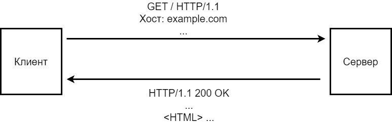

### Протоколы
Для общения с кем-либо мы должны разговаривать с собеседником на одном языке. В области сетей такие языки называются протоколами. Они устанавливают правила общения между компьютерами, чтобы те могли отправлять и принимать данные.

*Упражнение*

Linux, macOS
````commandline
[user@host]$ nc example.com 80
GET / HTTP/1.1
Host: example.com
````

Windows

По умолчанию telnet не установлен в Windows.

Однако, это очень полезный инструмент для поиск неисправностей в сетевых приложениях.
Для его установки можно воспользоваться этой инструкцией (https://www.makeuseof.com/enable-telnet-windows).
````commandline
> telnet
Microsoft Telnet> set localecho
Microsoft Telnet> open example.com 80
GET / HTTP/1.1
Host: example.com
````

## Адреса и маршрутизация

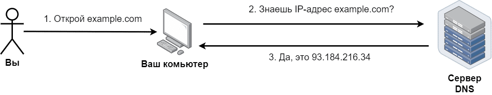

Процесс преобразования одного адреса в другой называется resolving («разрешение»).

*Этот процесс - "разрешение имени", или, если короче, resolving - работает следующим образом: ваша операционная система берет адрес DNS-сервера из своих сетевых настроек. Когда вы пытаетесь подключиться к ресурсу с определённым доменным именем, ОС отправляет серверу DNS специальный запрос: «отправь мне IP-адрес, соответствующий имени example.com». Получив запрос, сервер DNS ищет в очень большой таблице адрес для имени example.com и отправляет результат.*

*Упражнение*
+ Выясните адрес DNS-сервера, используемого вашей ОС, с помощью инструментов командной строки
+ Узнайте IP-адрес сервера example.com

ОС Linux, macOS:
````commandline
cat /etc/resolv.conf
host example.com
````

ОС Windows
````commandline
ipconfig /all
nslookup example.com
````

### IP-адреса и порты


IP-адрес — это набор из четырёх чисел, разделённых точками. Каждое число (они называются октетами) должно быть между 0 и 255. Например: 127.0.0.1, 8.8.8.8 или 192.168.0.1. Вы можете воспринимать его как почтовый индекс, необходимый для отправки посылки определённому человеку. IP-адрес есть у всех устройств, подключённых к современным сетям.

Чтобы установить соединение с удаленным узлом, нужно знать еще одно число, называемое номером "порта". Если IP-адрес — это почтовый индекс здания, то порт — это дверь с определённым номером в этом здании. В большинстве случаев каждый номер порта используется только для конкретной службы или протокола.

*Упражнение*
+ Откройте настройки сети вашего компьютера в графическом интерфейсе и выясните его IP-адрес (или IP-адреса, если их несколько)
+ Запустите командную оболочку и выясните IP-адрес(а) вашего компьютера следующими командами:

````commandline
Linux:
ip addr list

Windows:
ipconfig
````

### Маршрутизация

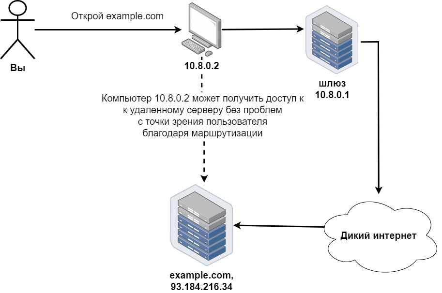

*Ваш узел должен каким-то образом связаться с сервером example.com(opens in a new tab). Это достигается с помощью механизма маршрутизации*

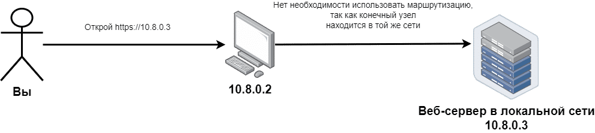
*Однако маршрутизация не нужна для доступа к компьютерам в вашей локальней сети*

Как каждый компьютер, подключённый к Интернету, обладает IP-адресом, так и каждый IP-адрес является частью некой сети. У сетей тоже есть адреса, состоящие из двух частей, разделённых косой чертой: адрес сети (network address) и маска подсети (netmask).

Адрес сети выглядит абсолютно так же, как IP-адрес узла. А маска сети (или "подсети", могут применяться оба термина) — это просто число между 0 и 32, с помощью которого компьютер узнаёт размер сети и диапазон IP-адресов, доступных в ней.

+ Чем больше значение маски подсети, тем меньше размер подсети и тем меньше IP-адресов в ней.
Например, маска /24 соответствует 256-и IP-адресам, а /28 — только 16-и.
+ Также маску подсети можно записать в длинной форме. В этом случае она выглядит похожей на IP-адрес.
Например, /16 и 255.255.0.0 — это одна и та же маска подсети в короткой и длинной форме соответственно.
+ Существует 33 возможные маски подсети.

Вот пример определения сети: 10.8.0.0/24, где 10.8.0.0 — это адрес сети, а 24 — это маска подсети. 24 эквивалентно 255.255.255.0.

Операционная система применяет адреса сетей и их маски внутри очень важной таблицы, называемой "таблица маршрутизации" (routing table).
С помощью этой таблицы компьютер узнаёт, как подключиться к тому или иному адресу.

````commandline
[user@host]$ ip route list
default via 10.8.0.1 dev eth0 proto dhcp src 10.8.0.2 metric 1024
10.8.0.0/24 dev eth0 proto kernel scope link src 10.8.0.2
192.168.0.0/24 dev eth1 proto kernel scope link src 192.168.0.2

Мы видим, что компьютер подключён к двум локальным сетям, 10.8.0.0/24 и 192.168.0.0/24, и обладает внутри каждой из этих сетей IP-адресами 10.8.0.2 и 192.168.0.2 соответственно.
````

+ Если пользователь попытается получить доступ к одному из узлов сети 10.8.0.0/24, то компьютер будет использовать для этого устройство с именем eth0. При попытке пользователя подключиться к узлу сети 192.168.0.0/24 компьютер использует устройство с именем eth1. Но что, если пользователь хочет подключиться к ресурсу с именем example.com? Мы не видим ничего похожего на адрес 93.184.216.34 (это IP-адрес ресурса с именем example.com).
+ Внутри каждой сети, подключенной к интернету (или просто к другим сетям, даже без выхода в Интернет), должен быть шлюз. Шлюз — это специальным образом сконфигурированный компьютер или сетевое устройство, подключённое к двум или более сетям и способное пересылать данные из одной сети в другую. Наиболее распространённым примером аппаратного сетевого шлюза является домашний роутер. IP-адрес шлюза указывается в настройках сети каждого подключенного к этой сети компьютера.
+ Таким образом, когда пользователь хочет установить соединение с 93.184.216.34 (или любым другим узлом из внешних сетей), операционная система будет применять маршрут по умолчанию, чтобы отправить клиентский запрос через шлюз с адресом 10.8.0.1. Далее ближайший шлюз пересылает запрос другому шлюзу, тот в свою очередь — следующему и т. д. Каждый шлюз маршрута называют  "хоп", или транзитный узел. Таким образом ваш запрос и достигает сервера example.com.

*Упражнение*
+ Выясните адрес и маску вашей локальной сети:
````commandline
Linux: ip addr list

macOS: ifconfig
(для преобразования масок сетей используйте эту таблицу(https://www.pawprint.net/designresources/netmask-converter.php))
Также команда ifconfig иногда встречается на Linux-системах

Windows: ipconfig
````
+ Узнайте максимально возможное количество IP-адресов, а также первый и последний адреса в вашей сети, применив этот калькулятор (https://www.calculator.net/ip-subnet-calculator.html)

+ Узнайте содержимое таблицы маршрутизации и найдите адреса шлюзов, в особенности шлюза по умолчанию:
````commandline
Linux: ip route list

macOS: netstat -rnf inet
Примечание: Разработчики Apple применяют непривычные обозначения адресов и масок сетей. Поэтому, при виде слишком коротких адресов сетей, просто дополните нулями недостающие октеты, например: 127 -> 127.0.0.0

Windows: route -4 PRINT
````
+ Постройте маршрут от вашего узла до сервера example.com:
````commandline
Linux, macOS:
traceroute example.com

Windows:
tracert example.com
````

### Физический уровень
В момент, когда данные уже готовы к передаче, клиентская ОС запрашивает сетевой адаптер для отправки этих данных по кабелю или беспроводному каналу. Сетевому адаптеру ничего не известно об IP-адресах, масках посети, шлюзе, используемом по умолчанию, и других программных сущностях, таких как ОС или предпочитаемый веб-браузер. Зато ему известен свой уникальный аппаратный адрес, называемый MAC-адресом (Media Access Control address — адрес управления доступом к среде передачи данных). MAC-адрес состоит из шести пар шестнадцатеричных символов, разделённых двоеточиями, например 46:09:9f:f5:87:aa.

К этому моменту уже известно, что узел example.com(opens in a new tab) находится за пределами вашей сети, поэтому вам нужен шлюз (в данном случае это 10.8.0.1). Первым делом операционная система запросит сетевой адаптер отправить специальное широковещательное сообщение: «узел с IP 10.8.0.1, ответь, мне нужен твой MAC-адрес, чтобы пообщаться с тобой» (при этом 10.8.0.1 — адрес из нашей локальной сети). В случае успеха операционная система получит следующую информацию: «узел с IP-адресом 10.8.0.1 обладает MAC-адресом 46:09:9f:f5:87:aa», и запишет её в специальную таблицу. В этой таблице отображаются устройства, с которым ваш узел "общался" в пределах локальной сети.
Так работает протокол ARP (Address Resolution Protocol — протокол определения адресов).

На следующем шаге клиентская ОС запрашивает сетевой адаптер передать сообщение вида "Узел с MAC-адресом  46:09:9f:f5:87:aa, для тебя есть сообщение: [текст сообщения]". Операционная система роутера (внутри этой маленькой коробочки также есть ОС) поместит ваше сообщение в пакет программного уровня, прочтёт IP-адрес узла назначения, выберет нужный интерфейс для дальнейшей пересылки и отправит сообщение через физический уровень этого интерфейса.

+ Сетевое взаимодействие, описанное выше, относится к уровню Data Link Layer в рамках стека TCP/IP
+ Физический уровень (Physical Layer) стека TCP/IP описывает передачу импульса или радиосигнала, способы помехоустойчивого кодирования, и т.п. На этом уровне не происходит взаимодействия ПО.
+ Протокол ARP применяется  для преобразования адресов только внутри локальной сети, его сообщения не могут передаваться через шлюзы в другие сети. 

### Сетевые адаптеры и IP-адреса
Сетевой адаптер (также может применяться термин "сетевой интерфейс") - физическое или виртуальное оборудование, предназначенное для приема-передачи сигналов по сети. Узлы и сетевые интерфейсы связаны как "один ко многим" (аналогично сущностям баз данных), например:
+ Компактный ноутбук может иметь всего 1 встроенный физический сетевой интерфейс, это WiFi-адаптер
+ Ноутбук большего размера как правило имеет 2 и более физических сетевых интерфейса, например один WiFi-адаптер и одну сетевую Ethernet-карту
+ Как ни странно, но современные смартфоны имеют как минимум 2 сетевых интерфейса (оба - беспроводные): один для передачи данных по мобильным сетям (4G или 5G), второй - WiFi-адаптер
+ Маршрутизаторы как правило имеют 2 или более сетевых интерфейса для соединения с разными сетями и передачи данных между ними
+ При установке VPN-соединения в системе появляется еще минимум 1 виртуальный сетевой интерфейс для обмена данными внутри VPN-соединения
+ Даже если у компьютера нет ни одного исправного физического сетевого интерфейса, все равно в системе присутствует минимум 1 виртуальный интерфейс, часто называемый loopback-интерфейсом или "интерфейсом обратной петли". Он нужен для взаимодействия клиентского и серверного ПО, запущенного на одном и том же узле. 
+ Не бывает случаев, когда один и тот же сетевой интерфейс принадлежит нескольким разным узлам. Даже если на узле запущено несколько виртуальных машин, которые имеют доступ к одному и тому же физическому сетевому интерфейсу, каждая из виртуальных машин имеет свой собственный виртуальный сетевой интерфейс.

Как отмечалось выше, должна быть связь между сетевыми интерфейсами и IP-адресами. Эта связь также имеет тип "один ко многим"; примеры ниже указаны в порядке убывания вероятности встретить такие настройки:
+ Самый частый случай: 1 сетевой интерфейс имеет 1 IP-адрес. Чаще всего именно так и происходит, когда вы подключаете узел к локальной сети.
+ Один сетевой интерфейс не имеет ни одного настроенного IP-адреса. Пример: вы включаете ноутбук там, где нет никаких точек доступа WiFi.
+ Один сетевой интерфейс имеет несколько IP-адресов. Такие настройки могут быть встретиться на сетевых устройствах или серверах в специфических ситуациях.
+ Один и тот же IP-адрес НЕ может быть назначен нескольким сетевым интерфейсам в рамках одной сети.

*Упражнение*
+ Выясните MAC-адрес вашего сетевого интерфейса:
````commandline
Linux: ip addr list

macOS: ifconfig

Windows: ipconfig
````
+ Получите содержимое ARP-таблицы вашего компьютера:
````commandline
Linux, macOS: arp -a -n

Windows: arp /a
````

## Сетевые уровни и протокол IP
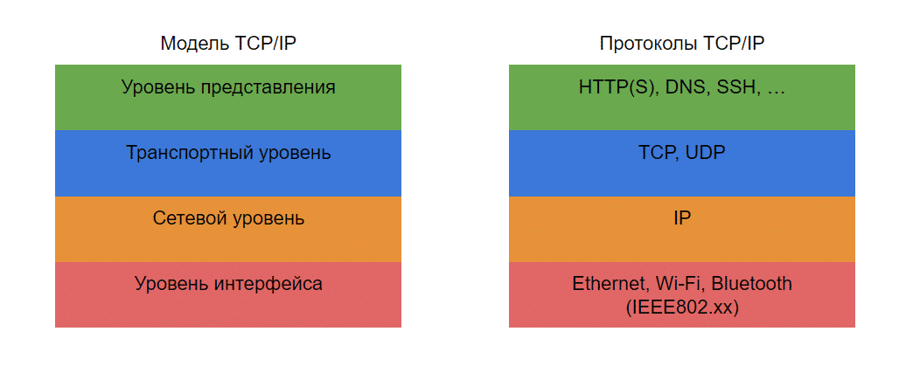

Механизм передачи данных очень сложен, поэтому модель TCP/IP разделена на четыре уровня (иногда на пять; самый нижний уровень, физический, на рисунке не показан)
+ **Прикладной уровень (Application Layer)**. Как следует из названия, это группа протоколов, служащих для взаимодействия между приложениями. Они используются каждый раз, когда пользователь запрашивает в сети какую-либо информацию с помощью приложения. Большая часть протоколов, работающих в рамках модели клиент-сервер, относится к прикладному уровню.
HTTP-протокол, упомянутый в предыдущем модуле, является наглядным примером прикладного протокола. Запрос клиента GET и ответ сервера с кодом 200 (успешное выполнение запроса), отправленные по протоколу HTTP 1.1 являются передачей данных приложения через сеть.
Протоколы прикладного уровня предназначены для запроса и передачи данных, то есть на этом уровне задаётся вопрос “ЧТО должно быть отправлено и получено”.
+ **Транспортный уровень (Transport Layer)**. Для управления передачей данных необходимо добавить некоторую служебную информацию: номера портов, поле подтверждения доставки или специальные данные для управления скоростью передачи. Эту служебную информацию необходимо добавить к данным приложения до их отправки другой стороне. Самые распространённые протоколы транспортного уровня это TCP (Transmission Control Protocol — протокол управления передачей) и UDP (User Datagrams Protocol — протокол пользовательских датаграмм). Протоколы транспортного уровня описывают КАК ИМЕННО запросы и ответы должны отправляться и приниматься: какой порт использовать, нужно ли проверять целостность данных и очерёдность пакетов, нужно ли повторно отправлять потерянные пакеты и т. д. 
+ **Сетевой уровень (Network Layer)**. Предназначен для адресации и поиска узла назначения, а также для маршрутизации. В модели TCP/IP сетевой уровень представлен протоколом IP (Internet Protocol — межсетевой протокол). Как видно из названия, это вторая часть, необходимая для реализации модели. Этот уровень отвечает на вопрос, как клиентам и серверам найти друг друга, даже если они расположены в различных несмежных сетях. Например, чтобы обеспечить доступ к серверу example.com из домашнего компьютера, задействуется протокол IP с элементами, необходимыми для маршрутизации.
+ **Уровень сетевого интерфейса (Datalink Layer / Interface Layer, он же "канальный уровень", либо "уровень сетевого доступа")**. Говоря о предыдущих уровнях, мы обсуждали программные сущности, но они не могут обойтись без физической передачи данных от одного компьютера к другому. Этот уровень служит интерфейсом между программным обеспечением (ПО) и физическими устройствами, например адаптерами для Ethernet, Wi-Fi, Bluetooth или модемами DSL.  Этот уровень также применяется для соединения устройств, находящихся в одной локальной сети, где используются аппаратные адреса без обращения к IP-адресам.
+ **Физический уровень (Physical Layer)**. Он располагается после уровня сетевого интерфейса и используется для  передачи данных по физической среде, например медному проводу, оптическому волокну или воздуху. На этом уровне нет программных протоколов, только физические сигналы.

### Коротко о стеке TCP/IP
Уровни модели TCP/IP связаны друг с другом посредством инкапсуляции, то есть помещения простых объектов в более сложные. 

Данные прикладного уровня — это текст или двоичный код. В сущности, можно передавать любую информацию. Другая причина, почему прикладной уровень называется именно так, заключается в том, что только на этом уровне вы можете составлять данные самостоятельно, на всех остальных уровнях вам придётся просить об этом операционную систему (ОС). Давайте представим, что нам нужно получить некоторые данные от сервера HTTP с адресом 192.168.100.5 и портом 80.
````commandline
curl 192.168.100.5
````
*cURL означает Client for URL (программный клиент для URL).*
Это инструмент командной строки, предназначенный для передачи данных по Интернету

Сначала, после выполнения команды curl 192.168.100.5, операционная система поместит ваши данные в пакет TCP. Пакет — это определённая структура данных, состоящая из заголовка, в котором содержится служебная информация, необходимая для передачи данных, и полезной нагрузки — поле Data, т е. данные.

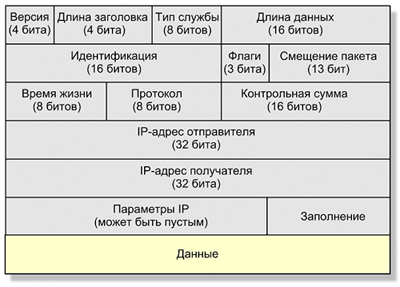

В пакете мы видим множество полей. Давайте обсудим три из них: порт назначения (Destination Port), контрольная сумма (Checksum), данные (Data). С помощью этих полей ОС обозначает: передаваемые данные (ваш запрос HTTP); контрольную сумму (результат специальной воспроизводимой двоичной операции) всех других полей, нужную, чтобы получатель мог проверить, что сообщение не повреждено; и номер порта назначения (80).

Ваша ОС поместит в поле Protocol (протокол) специальное число, говорящее получателю, что в поле Data лежит пакет TCP. Далее ОС помещает в поле Source address (адрес источника, отправителя) IP-адрес вашего компьютера, а в поле Destination address (адрес назначения, получателя) помещает IP-адрес удалённого узла. Весь пакет TCP будет помещён в поле Data. Ещё одно важное поле — TTL (Time to live — время существования). Оно содержит максимальное количество шлюзов, через которое может пройти пакет. Значение по умолчанию: 64 для Linux и macOS, 128 для современных версий Windows. Теперь нам нужно отправить наши данные еще "ниже" по стеку.

На нижнем уровне все предыдущие данные, помещённые в пакет IP, будут упакованы в поле Data кадра Ethernet (если используется именно Ethernet). Поле Destination address будет заполнено MAC-адресом узла назначения (или MAC-адресом шлюза, если таковой применяется), полученным с помощью протокола ARP. Аппаратный адрес вашего сетевого адаптера будет расположен в поле Source address. В поле CRC будет помещена контрольная сумма, необходимая для проверки того, что у отправителя и у получателя одинаковые копии данных.

## Основы IP-сетей
Сам по себе IP — это протокол сетевого уровня, реализующий две основные функции: адресацию и маршрутизацию.

### IP адресация
У каждого узла сети, построенной на основе протокола IPv4, есть специальный 32-битный IP-адрес, который используется для сетевого взаимодействия.

Другая важная часть IP-адресации — это маска подсети, специальный параметр, описывающий размер сети, к которой подключён компьютер. Маску подсети можно указать в двух формах: число между 0 и 32 или формат IP-адреса. Например, маски подсети "24" и "255.255.255.0" эквивалентны. Применение пар «адрес-маска подсети», разделённых косой чертой (например, 192.168.0.0/24 или 192.168.0.0/255.255.255.0), также известно как CIDR-адресация (Classless Inter-Domain Routing — Бесклассовая междоменная маршрутизация).

С помощью побитовой операции между IP-адресом и маской компьютер вычисляет диапазон адресов подсети. Например, узел с IP-адресом 192.168.0.1 и маской подсети 24 является частью подсети 192.168.0.0/24, включающей 256 адресов от 192.168.0.0 до 192.168.0.255. Расчёты проводятся с помощью простой двоичной арифметики: 2 ^ (32 - 24) = 2 ^ 8 = 256.

### Маршрутизация
В основе IP-сетей лежит следующая идея: разделить адресное пространство на подсети, поместить узлы внутрь подсетей, а затем, при необходимости, обеспечить установку соединения между подсетями. Механизм взаимодействия между сетями называется маршрутизацией.

Путь к узлу назначения операционная система выбирает, основываясь на таблицах маршрутизации.

````commandline
[user@linux]$ ip route
default via 192.168.0.1 dev eth0 proto dhcp src 192.168.0.134 metric 1024
10.8.0.0/24 dev tap0 proto kernel scope link src 10.8.0.1
192.168.0.0/24 dev eth0 proto kernel scope link src 192.168.0.134
````

Каждая строка таблицы маршрутизации содержит три основных объекта:
+ **Адрес назначения (первый элемент в строке)**, доступ к которому можно получить с помощью этой записи. Предусмотрено два варианта: адреса CIDR и default (по умолчанию). Последний вариант используется для связи со всеми узлами, которые не подходят под существующие правила маршрутизации. IP-адрес одного узла — это экземпляр адреса подсети (192.168.0.1 будет эквивалентен 192.168.0.1/32).
+ **Устройство**. Если вы пытаетесь получить доступ к узлу назначения, располагающегося в одной из подсетей, подключённых к вашим интерфейсам, то шлюз вам не потребуется. В этом случае вам нужно лишь дать знать операционной системе, что «к узлу из подсети 10.8.0.0/24 можно напрямую получить доступ с помощью интерфейса tap0, так как ему назначен адрес 10.8.0.1». В случае использования адреса шлюза нужный интерфейс будет определён автоматически с помощью маршрута к подсети шлюза.
+ **Шлюз** — это узел, который будет использоваться для доступа к сетям, к которым вы не подключены напрямую. Например, если вам нужно связаться с узлом по адресу 8.8.8.8, то, следуя показанной выше конфигурации, вам потребуется использовать шлюз 192.168.0.1. Перед этим вам нужно будет использовать запись маршрутизации с адресом назначения 192.168.0.0/24, для того чтобы получить доступ к шлюзу.

*упражнение*
+ Получите таблицу маршрутизации вашего компьютера, используя следующую команду: ip route list. Определите, какая последовательность маршрутов будет использоваться для связи с узлом 8.8.8.8.
+ Проверьте свой результат с помощью команды: ip route get.
+ Поэкспериментируйте с командой traceroute (ОС Linux, macOS) или tracert (ОС Windows) с целью определения маршрутов к различным узлам, таким как google.com, msn.com, yahoo.com и т. д.

### Откуда берутся IP-адреса
Пространство IP-адресов разделено на две части: частные и глобальные. Частные области были зарезервированы в документации межсетевого протокола (Internet Protocol — IP) как подсети для создания локальных сетей. Вот список зарезервированных для этого подсетей: 10.0.0.0/8, 172.16.0.0/12, 192.0.0.0/24 и 192.168.0.0/16. Эти сети не участвуют в глобальной маршрутизации, поэтому вы не сможете напрямую отправить пакет через Интернет в другую локальную сеть. Примечание: также есть специальная частная подсеть 127.0.0.0/8, о которой будет сказано ниже в разделе "Localhost".

Глобальные (также называемые публичными) — это просто адреса, не принадлежащие зарезервированным областям. Если вам нужен публичный адрес, вы можете запросить его у вашего интернет-провайдера. В свою очередь провайдер, как и все компании, которым нужно большое количество IP-адресов, может получить их у специальных компаний, называемых брокерами IP-адресов, или у региональных интернет-регистраторов.

*Что касается назначения IP-адресов в локальных сетях, то для их выбора обычно применяются два подхода:*
+ Большинство современных маршрутизаторов используют протокол DHCP (Dynamic Host Configuration Protocol — протокол динамического конфигурирования узлов) для автоматического назначения IP-адресов, адресов подсетей, маршрутов и адресов серверов DNS.
+ Вы можете использовать статическую конфигурацию, полученную от вашего интернет-провайдера или системного администратора. Аналогичным образом, если вы не хотите по какой-либо причине использовать протокол DHCP, то в своей собственной сети, дома, например, вы можете назначать адреса вручную, используя одну из частных подсетей.

### NAT: преобразование сетевых адресов

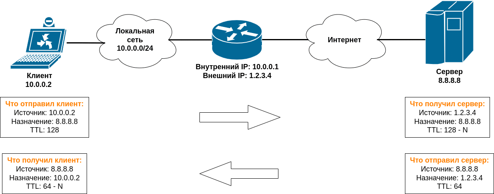

*что же делает маршрутизатор для соединения вашего компьютера с Интернетом.*
Предположим, у нас есть адрес 10.0.0.2 в локальной сети 10.0.0.0/24. У нашего маршрутизатора есть два интерфейса с адресами 10.0.0.1 и 1.2.3.4. Мы хотим отправить запрос публичному серверу DNS с адресом 8.8.8.8.

Первым делом ваш компьютер на сетевом уровне упаковывает запрос в пакет IP с адресом назначения 8.8.8.8, ищет в таблице маршрутизации маршрут для адреса 8.8.8.8 и даёт понять, что пакет должен отправляться на маршрутизатор посредством его MAC-адреса. Маршрутизатор получает пакет. Анализируя пакет IP, понимает, что он не конечный получатель. В этот момент в игру и вступает механизм NAT (Network Address Translation — преобразование сетевых адресов). Следите внимательно:
+ Маршрутизатор ищет в своей таблице маршрутизации маршрут к узлу назначения. В нашем случае он выберет интерфейс с публичным адресом 1.2.3.4.
+ Маршрутизатор сохраняет у себя информацию, что он теперь является промежуточным узлом между 10.0.0.2 и 8.8.8.8.
+ Маршрутизатор изменяет адрес источника в вашем пакете IP: с 10.0.0.2 на публичный адрес 1.2.3.4.
+ Маршрутизатор уменьшает значение поля TTL в вашем пакете IP на единицу. Это поле не позволяет пакету бесконечно блуждать по сети в случае образования маршрутной петли (контура). Каждый последующий маршрутизатор выполнит те же действия. Пакет с обнулившимся полем TTL будет отброшен.
+ Удалённый сервер DNS с адресом 8.8.8.8 обработает запрос и отправит ответ в новом пакете IP маршрутизатору с адресом 1.2.3.4, так как он думает, что узел с адресом 1.2.3.4 и есть автор запроса.
+ Маршрутизатор получает пакет с ответом от узла с адресом 8.8.8.8, проверяет свой список соединений и определяет, что этот пакет предназначен узлу с адресом 10.0.0.2.
+ Маршрутизатор изменяет в пакете адрес назначения с 1.2.3.4 на 10.0.0.2 и отправляет пакет клиенту.

*упражнение*
+ Откройте в браузере страницу https://showmyip.com, чтобы увидеть свой внешний IP-адрес.
+ Проследите маршрут до showmyip.com, используя команду traceroute (или tracert для ОС Windows), и попытайтесь найти в маршруте свой внешний IP-адрес (или шлюз из этой же подсети).

## Localhost
Вот как это работает:
+ Есть виртуальный сетевой интерфейс, реализующий механизм «обратной петли», обычно с именем lo (на ОС Linux) с назначенным адресом 127.0.0.1 и маской подсети 255.0.0.0. Хитрость интерфейса с обратной петлей в том, что он всегда ответит, на какой бы адрес этой подсети вы не отправили сообщение. Поэтому, хотя вы видите только один назначенный интерфейсу адрес 127.0.0.1, если вы попытаетесь подключиться к любому адресу из подсети 127.0.0.0/8, то результат всегда будет одинаков.
+ Есть специальное имя localhost (локальный узел), служащее псевдонимом для узла с адресом 127.0.0.1. Его можно использовать вместо IP-адреса, если вам так удобнее.
+ Когда вы пытаетесь подключиться к 127.0.0.1, операционная система видит, что этот адрес относится к маршруту, связывающему подсеть 127.0.0.0/8 с интерфейсом lo. Затем ваши данные будут отправлены виртуальному интерфейсу с обратной петлёй, а операционная система получит входящее сообщение, обработает его и самостоятельно ответит.

*Упражнение*
+ Получите список открытых портов на вашем компьютере (адреса 0.0.0.0 и * означают, что этот порт открыт для всех адресов вашего узла) с помощью следующих команд::

Linux: netstat -vpntul (если netstat отсутствует, то попробуйте ss -pntul). 

macOS: netstat -anf inet | egrep LISTEN.
+ Постарайтесь определить порты, доступные для localhost, то есть порты, прослушиваемые на всех адресах или явно на 127.0.0.1.
+ Узнайте, какие службы могут использовать эти порты, с помощью  списка стандартных портов(opens in a new tab).
+ Есть ли порты, доступные только для адреса 127.0.0.1?

## DNS: Система доменных имён (Domain Name System)
Основной способ использования системы DNS — это преобразование доменных имён в IP-адреса.

как эта система работает:
Сначала ваша операционная система будет искать это имя в локальном списке, состоящем из пар «имя узла — IP-адрес». В большинстве UNIX-подобных систем он находится в файле /etc/hosts. Например, запись, гласящая, что имя localhost эквивалентно адресу 127.0.0.1, находится именно здесь. В случае неудачи ОС возьмёт адрес DNS сервера  из файла /etc/resolv.conf и инициирует отправку запроса ему (в/etc/resolv.conf часто указано, что основной DNS-сервер расположен локально на 127.0.0.1).

Если вам нужно преобразовать какое-либо имя посредством утилит командной строки, то это можно сделать следующими способами:
+ Используя команду host, когда нужен короткий ответ.
+ В UNIX-подобных системах есть очень мощный инструмент для преобразования имён — dig. Он выводит большой объём информации. Давайте поэкспериментируем с ними.

Применяемые по умолчанию команды hos и dig работают одинаково: просто укажите имя узла, который нужно преобразовать, сразу после названия команды. В этом случае для обработки вашего запроса будет использоваться сервер DNS, который применяется по умолчанию. Но вы можете обратиться и к другому серверу, например к общедоступному серверу DNS компании Google по адресу 8.8.8.8. Это можно сделать следующим образом:
````commandline
host example.com 8.8.8.8

### or, to get more details:
dig example.com @8.8.8.8

### or, if you want to get short information from dig:
dig example.com @8.8.8.8 +noall +answer
````
На самом деле нам нужно преобразовать имя с точкой на конце — www.example.com., чтобы быть уверенными, что это полное имя, известное также как FQDN (Fully Qualified Domain Name — полностью определённое имя домена). Кроме того, каждое доменное имя может быть разделено точками на зоны (www, example и com). Если зона действительно существует, то должен быть по крайней мере один сервер DNS, располагающий полной информацией об этой зоне. Такие серверы называются полномочными (authoritative) серверами DNS.

Зоны и их полномочные сервера упорядочены в иерархической структуре, начинающейся с конца доменного имени. Существует группа корневых серверов (зелёного цвета на схеме), в которых хранится информация о зонах первого уровня (жёлтого цвета) и об их полномочных серверах. В свою очередь серверы первого уровня располагают информацией о зонах второго уровня (красный цвет). Это может продолжаться бесконечно, но обычно серверы зон второго уровня и следующих работают в рекурсивном режиме (т.е. отвечают на все запросы про нижестоящие доменные имена), поэтому вы можете запросить у серверов второго уровня информацию о доменах нижних уровней.

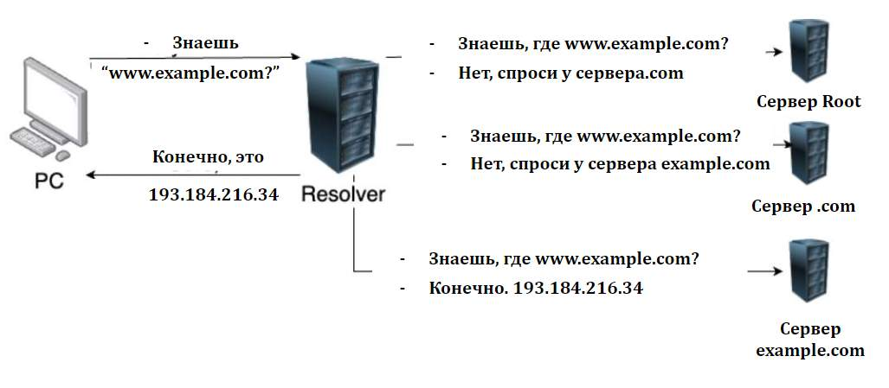

Другой тип серверов DNS, которые всегда работают в рекурсивном режиме, это «резолверы» (преобразователи, сопоставители). Такие преобразователи обычно не хранят информацию о доменах, они просто обрабатывают запросы клиентов и перенаправляют их серверам иерархического дерева. Адрес ближайшего «резолвера» можно найти в сетевых настройках вашего компьютера.

*Упражнение*
+ Посмотрите в файле /etc/hosts список имён узлов, к которым можно получить доступ без обращения к серверу DNS.
+ В файле /etc/resolv.conf найдите адрес вашего «резолвера», применяемого по умолчанию.
+ оспроизведите логику работы «резолвера» для имени www.example.com, используя команду dig:
  + Начните с запуска «dig .», чтобы получить запись корневого сервера DNS.
  + Используйте первое имя узла из записи SOA в качестве сервера зоны «com.».
  + Продолжите до получения конечного результата.
  + Попрактикуйтесь с другими доменными именами.
+ Для самопроверки выполните команду «dig +trace @8.8.8.8 example.com», которая отобразит все шаги по преобразованию имени example.com.


## Транспортный уровень модели TCP/IP
Суть транспортного уровня - в определении способов передачи данных, то есть в определении, как именно данные будут передаваться.

Транспортный уровень модели TCP/IP представлен в большинстве случаев протоколами TCP (Transmission Control Protocol — протокол управления передачей) и UDP (User Datagram Protocol — протокол пользовательских датаграмм). Оба протокола выполняют задачу по транспортировке данных приложений, но делают это по-разному.

### Сетевые пакеты
Данные запросов и ответов серверов и клиентов не текут по сети плавно и непрерывно, как река. Поток данных больше похож на фотоны — поток множества незаметных частиц.

Поэтому нельзя передать большой файл за раз одной порцией. Он разделяется на пакеты (порции данных наподобие фотонов), а затем эти пакеты отправляются и принимаются, далее пакеты снова собираются в файл и передаются приложениям (это верно как для приложений клиентов, так и для приложений серверов).

Максимальный размер пакета зависит от настроек канального уровня, в современных сетях он обычно равен 1500 байтов. Теоретически каждый пакет может маршрутизироваться отдельно. Это зависит от настроек маршрутизаторов, находящихся между клиентом с сервером.

### Сетевые порты
При запуске сетевое серверное приложение (например, веб-сервер) открывает порт и начинает прослушивать его. 
+ Представьте, что у аппаратного сервера есть IP-адрес 1.2.3.4 и приложение веб-сервера прослушивает порт 80.
+ Одновременно на этом же аппаратном сервере может работать приложение сервера электронной почты, использующее порт 25 для принятия входящих запросов.
+ Это означает, что если клиент хочет получить веб-страницу, то он должен отправить запрос на порт 80, но если он хочет отправить электронное письмо, то он должен направить его на порт 25.

Когда клиент обменивается данными с сервером, порт также открыт и на стороне клиента; этот порт используется приложением клиента, для взаимодействия с удалённым сервером.
+ Каждое соединение будет представлено уникальным кортежем значений: {transport_protocol, client_IP, client_port, server_IP, server_port} (транспортный_протокол, IP_клиента, порт_клиента, IP_сервера, порт_сервера). Это позволяет операционной системе (ОС) клиента различать соединения разных программ, обменивающихся данными с разными удалёнными серверами.
+ Итак, узел клиента работает с несколькими серверами одновременно.
+ Более того, один и тот же узел клиента может работать с одним и тем же приложением сервера (например, 1.2.3.4:80), используя одновременно несколько приложений (например, вы можете запрашивать страницы одного и того же веб-сайта с помощью браузеров Firefox, Safari, Chrome, Opera), — для каждого соединения будет использоваться свой порт клиента, поэтому потоки данных не перепутаются.

Для каждого протокола, TCP и UDP, доступно по 65 536 портов.

В большинстве случаев на сервере (вычислительной машине) прослушивается не больше 50 портов, при этом для большинства серверных приложений используется по одному, иногда по два порта.

### TCP — протокол управления передачей
Он выполняет следующие очень важные функции:
+ Управление очерёдностью данных. На стороне получателя пакеты собираются воедино в том же порядке, в котором они были отправлены.
+ Повторная отправка потерянных пакетов. Если получение пакета не подтверждено любой из сторон, этот пакет запрашивается снова.
+ Управление потоком. Если одна конечная точка отправляет данные быстрее, чем вторая способна обрабатывать, то более медленная сторона может запросить снижение скорости отправки.

Все эти функции реализуются с помощью заголовков TCP.
Размер заголовка TCP колеблется между 20 и 40 байтами, это не так мало, учитывая максимальный размер пакета (1500 байт в большинстве случаев), но такие дополнительные накладные расходы позволяют достичь хорошего уровня надёжности.
Некоторые функции протокола TCP реализованы с помощью так называемых флагов, представляющих собой специальные данные в заголовке TCP.

Важная часть протокола TCP — это соединение.
По протоколу TCP данные можно отправлять только после установки соединения между клиентом и сервером. Процедура установки соединения называется «рукопожатием TCP» (TCP handshake):
+ Клиент отправляет серверу специальный пакет с установленным флагом SYN (synchronization — синхронизация). 
+ Сервер получает этот пакет и отправляет ответ с установленными флагами SYN и ACK (acknowledgement — подтверждение).
+ Клиент отправляет пакет с установленным флагом ACK.

После этого соединение считается установленным и обе стороны могут отправлять запросы и ответы.

Если одна из сторон хочет завершить соединение (это может быть как клиент, так и сервер), то выполняется очень похожая процедура, называемая закрытием связи или завершением соединения ("TCP teardown" от англ. teardown — демонтаж, разрушение, разборка, освобождение канала). 
+ Инициирующая сторона отправляет пакет с флагом FIN (finish — завершать; окончание).
+ Вторая сторона отвечает пакетом с флагом ACK и затем ещё одним пакетом с флагом FIN — они могут быть объединены в один пакет FIN+ACK.
+ Инициирующая сторона отправляет подтверждение с флагом ACK.

Протокол TCP обычно используется как основа для обмена данными между сетевыми приложениями, которым необходим строгий порядок отправки и получения данных и гарантия доставки. Примеры таких приложений:

+ Электронная почта
+ Торговля через Интернет и банковские приложения;
+ Базы данных
+ Веб-сервисы

### UDP — протокол пользовательских датаграмм
Этот протокол работает с высокой скоростью и требует меньше вычислительных ресурсов. При инкапсуляции протокол UDP добавляет в пакет IP минимум информации. Но это единственная хорошая новость, поскольку протокол UDP не предусматривает упорядочивание пакетов, подтверждение получения данных и управление скоростью потока. UDP не использует соединение: нет ни «рукопожатия», ни вежливого «прощания», только передача данных от одной точки к другой.

Полезно применять протокол UDP в случае потоковой передачи мультимедиа, голосовой связи (VoIP), преобразования доменных имён в системе DNS и онлайн-игр. Во всех этих случаях просто нет времени на повторную отправку повреждённых данных. К моменту повторной отправки эти данные уже утратят актуальность.

Как и в TCP, в протоколе UDP предусмотрено следующее:
+ Порты как для клиента, так и сервера.
+ Работа с сокетами.

*упражнение*
Отобразите список прослушиваемых на вашем компьютере портов TCP и UDP с помощью следующей команды:

```commandline
В ОС Linux это лучше выполнить от имени пользователя root (если возможно):
netstat -vpntul
если "netstat" не установлена, то можно использовать: ss -pntul

macOS:
netstat -anf inet | egrep -v 'EST|WAIT' | sort | uniq

Windows:
netstat
```

Отобразите активные соединения и попробуйте соотнести их с клиентскими приложениями (возможно на ОС Linux):
```commandline
ОС Linux. Лучше выполнять от имени пользователя root:
netstat -vpntu
если "netstat" не установлена, то можно использовать: ss -pntu

macOS:
netstat -anf inet | egrep EST

Windows:
netstat -a
```

## Анализаторы сетевого трафика
Чтобы заглянуть внутрь сетевых пакетов, проще всего использовать анализаторы сетевого трафика (известные также как «снифферы», от англ. sniff — нюхать). Это специальные программы, собирающие необработанные данные на сетевых интерфейсах узла, на котором они запущены, и представляющие эти данные в формате, удобном для человека. Самые популярные анализаторы — tcpdump и Wireshark.

### tcpdump
это анализатор пакетов с интерфейсом командной строки, совместимый с большинством современных ОС. Этот инструмент очень удобен для работы на серверах, на которых нет графического интерфейса.

```commandline
tcpdump <options> <expression>

Опции (options) определяют, что и как будет собираться, а также задают выражения (expression) - фильтры
```

*Опции для сбора пакетов*
+ "-c <N>"(например, -c 20): собрать первые N пакетов и выйти. По умолчанию, "tcpdump" работает до остановки нажатием Ctrl+C (на самом деле эта комбинация клавиш отправляет сигнал SIGINT, как объяснялось в модуле Linux).
+ "-i <interface_name>" (название интерфейса): с помощью этой опции можно указать сетевой интерфейс, например lo или eth0; по умолчанию берётся первый интерфейс, не являющийся "lo". Для сбора пакетов со всех интерфейсов нужно указать следующее: -i any.
+ "-s <N>": установка захватываемой длины пакета. -s 0 — для сбора полных пакетов; -s60 — для сбора только первых 60 байт каждого пакета.
+ "-w <file>" (файл): сохранять поток собранных данных в файле формата PCAP (специальный формат файлов для хранения необработанных сетевых данных) вместо вывода на терминал.
+ "-r <file>" (файл): считывать пакеты из файла PCAP, а не из сетевых интерфейсов. Опция полезна для глубокого исследования сетевого потока, например, когда вы изучаете сетевые неисправности и хотите поделиться соответствующими собранными пакетами с коллегами из отдела разработчиков или DevOps-инженеров.

*Опции для отображения*
+ "-n": не преобразовывать IP-адреса в имена узлов.
+ "-nn": показывать адреса узлов в виде IP-адресов, а порты в виде номеров. Эту опцию рекомендуется использовать в большинстве случаев.
+ "-X": вывод необработанного содержимого пакетов, представленного как шестнадцатеричной формой, так и форматом, удобным для человека (символы ASCII). Очень полезна для более тщательного анализа содержимого пакетов при изучении неисправностей.
+ "-A": вывод необработанного содержимого пакетов в компактном формате без шестнадцатеричной части. Если не указаны -X, и -A, то в формате, удобном для человека, отображаются только заголовки.
+ "-ttt": вместо полной временной метки выводить прирост времени с момента предыдущего элемента.
+ "-v / -vv / -vvv": три степени подробности.


*Выражения (фильтры)*
С помощью выражений (также называемых фильтрами) определяются элементы, которыми необходимо ограничить сбор данных.

Все эти элементы можно сочетать с помощью ключевых слов or (или), and (и), not (не), а также с помощью скобок. Если применяются скобки, то выражение необходимо заключать в кавычки, например: "(tcp or icmp)", а не (tcp or icmp). Можно применять как двойные, так и одинарные кавычки.

| Синтаксис        | Значения                                                                                                                                                         | Примеры выражений (фильтров)                                                               | Пояснение                                                                                                                                                                   |
|------------------|------------------------------------------------------------------------------------------------------------------------------------------------------------------|--------------------------------------------------------------------------------------------|-----------------------------------------------------------------------------------------------------------------------------------------------------------------------------|
| host X           | Только трафик, исходящий от узла X или предназначающийся ему. Это двунаправленное условие, поэтому собираются как запросы клиентов, так и ответы серверов        | host example.com   host 8.8.8.8                                                            | Весь поток пакетов между данным узлом (на котором установлена программа tcpdump) и удалённым узлом example.com. То же для узла 8.8.8.8                                      |
| net X/Y          | Подобно host, но собирается поток данных для всех узлов этой сети. X — адрес сети, Y — маска подсети                                                             | net 8.8.0.0/16                                                                             | Весь поток пакетов, проходящий между данным узлом и любым узлом сети 8.8.0.0/16                                                                                             |
| tcp / udp / icmp | Название протокола, поток которого будет собираться                                                                                                              | tcp and port 8080  udp and not port 53   icmp                                              | Пакеты TCP, исходящие из порта 8080 или предназначающиеся ему. Пакеты UDP, исходящие из любого порта или предназначающиеся любому порту кроме 53. Все пакеты протокола ICMP |
| port X           | Номер порта протокола TCP или UDP. Не применимо к ICMP, так как в рамках этого протокола порты не используются                                                   | "tcp and (port 22 or port 3389)"  port 53                                                  | Пакеты TCP, исходящие из порта 22 или 3389 или предназначающиеся им. Пакеты TCP и UDP, исходящие из порта 53 или предназначающиеся ему                                      |
| src              | Применимо к ключевым словам host, net, port, portrange. Означает поток данных, исходящий от этого источника: узла, сети, порта или диапазона портов (portrange)  | tcp and src host 192.168.40.150 and src port 22   udp and dst host 8.8.8.8 and dst port 53 | Пакеты TCP, исходящие от узла 192.168.40.150 и с портом источника 22.Это входящий поток данных протокола SSH от узла 192.168.40.150, этот узел выполняет роль сервера SSH.  |
| dst              | Подобно src, но означает поток данных, идущий к указанному узлу, сети, порту, диапазону портов                                                                   | tcp and src host 192.168.40.150 and src port 22   udp and dst host 8.8.8.8 and dst port 53 | Запросы клиента «резолверу» DNS с IP-адресом 8.8.8.8 (ответы сервера не будут собираться).                                                                                  |
| portrange X-Y    | Сбор только пакетов протокола TCP или UDP с любым номером порта (исходящего и входящего) в диапазоне от X до Y                                                   | tcp and src portrange 1-1023                                                               | Все пакеты TCP, исходящие от портов с номерами от 1 до 1023                                                                                                                 |

*Пример*
Давайте соберём все пакеты TCP с портами 80 или 443, идущие между данным узлом и узлом example.com(opens in a new tab).
```commandline
sudo tcpdump 'tcp and host example.com and (port 80 or port 443)'
```
Теперь давайте посмотрим на обмен данными по протоколу UDP, проанализировав процесс преобразования доменного имени example.com общедоступным сервером DNS (т. е. «резолвером») с адресом 8.8.8.8:

```commandline
[user@host]$ sudo tcpdump -nn -ttt 'udp and host 8.8.8.8 and port 53'
tcpdump: data link type PKTAP
tcpdump: verbose output suppressed, use -v or -vv for full protocol decode
listening on pktap, link-type PKTAP (Apple DLT_PKTAP), capture size 262144 bytes
 00:00:00.000000 IP 192.168.0.6.49292 > 8.8.8.8.53: 24940+ [1au] A? example.com. (40)
 00:00:00.028381 IP 8.8.8.8.53 > 192.168.0.6.49292: 24940$ 1/0/1 A 93.184.216.34 (56)
```
Как вы видите, обмен данными намного короче, так как нет «рукопожатия», используемого в протоколе TCP. В выводе мы видим только передачу данных.

*упражнение*
```commandline
Для пользователей Linux :

Программа tcpdump обычно не устанавливается по умолчанию, но её можно легко установить из официального репозитория, выполнив, например, команду apt install tcpdump (для дистрибутивов Ubuntu и Debian)
Программа curl обычно устанавливается по умолчанию, в противном случае установите её из официального репозитория

Для пользователей macOS: 

tcpdump и curl установлены по умолчанию
Wireshark(opens in a new tab) можно установить вместо tcpdump, для фильтров этой программы используется тот же синтаксис

Для пользователей Windows: 

Wireshark(opens in a new tab) можно установить вместо tcpdump, для фильтров этой программы используется тот же синтаксис
Если вы предпочитаете инструменты командной строки, то вместо tcpdump можно установить  Npcap(opens in a new tab)
curl(opens in a new tab) также можно установить отдельно

Задача:

Сравнение TCP и  UDP
Для пользователей Windows: выполните все шаги из этой статьи(opens in a new tab), и ответьте на вопрос 1.d ниже.
Для пользователей macOS и Linux:

Откройте два терминала.

В первом терминале начните отслеживать весь поток данных, направляемый на адрес 8.8.8.8 и порт 53 в режиме подробного вывода.

Выполните команду (на самом деле две команды) на втором терминале:dig example.com @8.8.8.8; dig example.com @8.8.8.8 +tcp.

Найдите отличия между работой протокола DNS поверх TCP и поверх UDP
```

## TCP: продвинутый материал
В протоколе TCP используются соединения, поэтому мы не можем просто начать отправлять данные — сначала нам нужно установить соединение с удалённым узлом, используя трёхшаговый процесс установки связи (называемый «рукопожатием TCP», как упоминалось ранее). Алгоритм следующий:
+ В самом начале у нас есть клиент без каких-либо соединений и связанных с ними состояний, и сервер в состоянии LISTEN (прослушивание), которое означает, что сервер ждёт запроса на установку соединение. Если клиент попытается соединиться с портом, который никто не прослушивает, то он получит пакет с флагом RST (reset — сброс).
+ Клиент генерирует случайный номер (X) и отправляет его серверу в специальном пакете с меткой SYN, помещённой в поле флагов. SYN означает «синхронизация». Теперь соединение находится в состоянии SYN-SENT (SYN отправлен).
+ Сервер получает от клиента пакет SYN и формирует пакет с подтверждением, копируя в поле номера подтверждения значение X + 1. Также сервер устанавливает в своём пакете флаг SYN и записывает свой случайный номер (Y), а затем отправляет пакет клиенту. Теперь соединение находится в состоянии SYN-RECEIVED (SYN получен).
+ Клиент получает от сервера пакет SYN+ACK и отправляет обратно пакет с флагом ACK и номером Y + 1. Дело сделано. Теперь у нас есть соединение в состоянии ESTABLISHED (установлено).

### *Программа netstat*
+ -n: отображение портов и адресов узлов в виде чисел и IP-адресов соответственно. Рекомендуется ее применять. Если эту опцию упустить, то вместо чисел будут показываться имена служб (из файла /etc/services) и имена узлов, что очень неудобно, поэтому если вам нужны номера портов, то используйте опцию -n.
+ "-t" отображение портов TCP.
+ -u: отображение портов UDP; может сочетаться с -t.
+ -l: отображение только прослушиваемых портов. Если эту опцию упустить, то будут отображаться только активные соединения (а не прослушиваемые порты).
+ -a: отображение как прослушиваемых портов, так и активных соединений.
+ -p: отобразить процессы, открывшие эти порты и соединения; показывается ограниченный объём информации, если вы не являетесь пользователем root.

Пример с прослушиваемыми портами, для TCP и UDP
````commandline
netstat -ntul
Активные интернет-соединения (только сервера)
Proto Recv-Q Send-Q Local Address           Foreign Address         State      
tcp        0      0 0.0.0.0:22              0.0.0.0:*               LISTEN     
tcp        0      0 127.0.0.1:25            0.0.0.0:*               LISTEN     
tcp        0      0 127.0.0.53:53           0.0.0.0:*               LISTEN     
tcp6       0      0 :::22                   :::*                    LISTEN     
tcp6       0      0 :::7031                 :::*                    LISTEN     
tcp6       0      0 ::1:25                  :::*                    LISTEN     
tcp6       0      0 :::33060                :::*                    LISTEN     
tcp6       0      0 :::9031                 :::*                    LISTEN     
tcp6       0      0 :::3306                 :::*                    LISTEN  
udp        0      0 127.0.0.53:53           0.0.0.0:*    
````
+ Для прослушиваемых портов внешние адреса показываются как 0.0.0.0:* — это нормально.
+ Локальные адреса, наподобие 1.2.3.4:5000, показывают, на каком IP-адресе доступен этот порт, например:
  + 0.0.0.0 означает, что этот порт доступен на всех IP-адресах этого сервера. Например, если у сервера IP-адреса 1.2.3.4 и 5.6.7.8, то клиенты для доступа к этому порту (и соответствующему приложению, прослушивающему этот порт) могут указать любой из этих адресов.
  + 127.0.0.1 означает, что этот порт доступен только на этом IP-адресе, то есть, чтобы получить доступ к этому порту (например, 25), клиент должен использовать IP-адрес 127.0.0.1. Согласно сказанному ранее в этом модуле, это возможно, только если клиентское приложение и сервер работают на одном компьютере.
+ ":::7031" вместе с меткой "tcp6" означают, что порт TCP 7031 доступен посредством протокола TCP, при использовании как IPv4, так и IPv6, на любом IP-адресе компьютера. Символы “::” в версии IPv6 являются аналогом 0.0.0.0 в версии IPv4, обозначающим все IP-адреса.
+ "::1:25" означает то же, что и описанное в п. 3, но для IPv6. Поэтому "::1" в версии IPv6  это аналог адреса 127.0.0.1 версии IPv4.
+ Для портов UDP состояние LISTEN не показывается, но в действительности они являются прослушиваемыми портами.
+ Похоже, что порт 53 используется дважды! Это кажется невозможным, так как сокеты должны использовать уникальные номера портов. Действительно должны, но только в рамках одного транспортного протокола.
То есть сокеты с протоколами TCP и UDP — это разные сокеты, поэтому один и тот же номер порта можно открыть дважды, если один порт относится к TCP, а второй к UDP. По этой причине в технических руководствах (или в файле /etc/services) можно встретить что-то подобное следующему: 22/tcp, 53/udp и т. д., так как каждый номер порта должен сопровождаться названием соответствующего транспортного протокола. 

### *Wireshark*
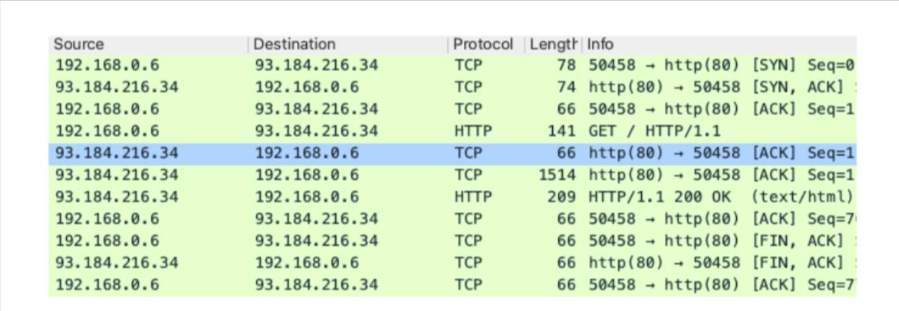

Каждая строка представляет один пакет, если речь о протоколах TCP и UDP. Также программа может автоматически определять сообщения протоколов прикладного уровня (например, HTTP, который подробно будет рассмотрен в последующих разделах учебника) и показывать их по отдельности. В нашем случае мы видим HTTP в столбце Protocol (протокол).

Нажатием на строки можно получить полную информацию о соответствующем элементе, начиная с текущего уровня и заканчивая уровнем сетевого интерфейса, и изучить заголовки каждого уровня по отдельности.

+ Фильтрацию по адресу можно настроить с помощью конструкций ip.host, ip.src_host или ip.dst_host. Обратите внимание, что Wireshark не преобразует имена узлов в IP-адреса, это нужно делать вручную.
+ ip.addr используется для фильтрации по адресу подсети.
+ Для фильтрации по порту используйте tcp.port или udp.port для двухсторонней фильтрации и tcp.srcport, udp.srcport, tcp.dstport, udp.dstport для односторонней фильтрации.
+ Wireshark поддерживает фильтрацию по названию протокола, например tcp, udp, http, dns, ssh и т. д.
+ Как и в tcpdump, в фильтрах можно сочетать различные конструкции. Например:
````text
‘ip.host == 93.184.216.34 and http’

‘ip.addr == 192.168.0.0/24 and tcp.port == 80 and not http’

‘ip.host == 8.8.8.8 and (udp.port == 53 or tcp.port == 53).
````

Последнее, о чём стоит рассказать: нажатие на кнопку с изображением плавника акулы запустит сбор данных из сетевых интерфейсов компьютера вместо отображения содержимого файла PCAP. Попробуйте выбрать интерфейс с помощью кнопки настроек, если сбор не начался.

## Поиск сетевых неисправностей
### *ICMP — Internet Control Message Protocol*
Хотя ICMP является протоколом транспортного уровня (поскольку он непосредственно инкапсулируется в пакеты IP), с его помощью не передают приложения не передают какие-либо данные. Единственное, для чего он служит, это пересылка сообщений о состоянии узлов и сетевых проблемах от одного узла к другому.

У пакета ICMP довольна простая структура из четырёх полей: тип сообщения (Type), код подтипа (Code), контрольная сумма (Checksum) и основное содержимое (Content).

Здесь нет портов. Есть несколько часто используемых типов сообщений протокола ICMP, которые указываются с помощью полей Type и Code заголовка:

+ “Echo Request”(Эхо-запрос) и “Echo Reply” (Эхо-ответ). Эти типы используются утилитой ping, а также программой traceroute в режиме ICMP.
+ "Destination Unreachable" (Адресат недостижим). Используя этот тип сообщения, шлюзы уведомляют, что они не могут достичь узла назначения текущего IP-пакета. Также в некоторых случаях удалённый узел может отправить сообщение “Destination port unreachable” (Порт назначения недостижим) в ответ на попытку подключения по протоколу UDP к закрытому порту (так как у самого UDP нет способа реакции на такое событие).
+ Time Exceeded (Время истекло). Если на шлюз пришел пакетом с нулевым полем TTL в заголовке IP (Time to live — время существования, то есть количество промежуточных узлов, до исчерпания которого пакет существует в сети, а затем отбрасывается маршрутизатором), то он пошлёт отправителю сообщение «Время истекло». Именно на основе этого принципа работает утилита traceroute.

Что касается двух оставшихся полей пакета ICMP:

+ Content — по большей части ничего не значащая последовательность байт, используемая в большинстве случаев просто в качестве заполнителя.
+ Checksum — контрольная сумма, вычисляемая для поля Content.

### ping
Она выполняет две очень простые, но очень важные функции: 

+ Проверка достижимости удалённого узла.
+ Измерение времени, потраченного на передачу и подтверждение пакета (параметр RTT, round-trip time — время кругового пути), то есть суммарного времени для передачи пакета от клиента серверу и обратно.

Программа работает следующим образом: удалённому узлу отправляется эхо-запрос протокола ICMP; если удалённый узел настроен надлежащим образом, то он отправит пакет с эхо-ответом протокола ICMP. Параметр RTT равен интервалу между отправкой запроса и получением ответа. 

````commandline
ping [options] <remote_host>
````
Полезные опции:
+ -c <N>: остановиться после N пакетов
+ -s <N>: отправлять пакеты размером N байт
+ -t <N>: установить значение поля TTL IP-пакета в N

````commandline
# Проверить связь с узлом (нажмите Ctrl-C, чтобы остановить работу программы):
ping example.com

# Выполнить Ping для десяти пакетов и выйти:
ping -c 10 example.com

# Проверить связь с помощью высокой загрузки сети (не использовать для внешних узлов, это может быть расценено как атака!):
sudo ping -A -s 65000 192.168.100.1

# Получить IP-адрес шлюза, используемого по умолчанию: при значении TTL = 1 пакет будет отброшен ближайшим промежуточным узлом (то есть вашим шлюзом, используемым по умолчанию) с отправкой сообщения «Время истекло»
ping -t 1 example.com
````

+ ping не измеряет пропускную способность соединения. Могут быть соединения с низкой задержкой (т. е. параметром RTT) и одновременно с низкой пропускной способностью («скоростью»), а также с высоким RTT и высокой пропускной способностью.
+ ping нельзя использовать для проверки доступности удалённого порта. Это распространённая ошибка новичков: на вопрос «как вы будете проверять, открыт удалённый порт или нет?», некоторые отвечают «я буду использовать ping». В протоколе ICMP нет портов, и он не относится к протоколам TCP и UDP, поэтому его нельзя применить для такой проверки. Вместо этого используйте программы nc или nmap
+ Порой протокол ICMP бывает полностью заблокирован в настройках межсетевых экранов или серверов — по этой причине вы можете не получить эхо-ответ даже от доступных корректно работающих узлов. Поэтому, если вам не пришёл эхо-ответ от удалённого сервера, это может означать всего лишь работу межсетевого экрана.

### *traceroute*


