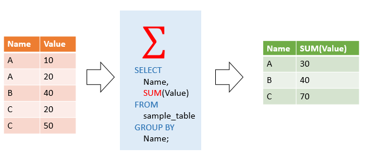

```sql
Чтобы получить общую стоимость заказа каждого продукта, вы можете использовать функцию SUM()в сочетании с GROUP BYпредложением следующим образом:

SELECT 
    productCode, 
    SUM(priceEach * quantityOrdered) total
FROM
    orderDetails
GROUP BY productCode
ORDER BY total DESC;
```




```sql
вы можете использовать AVG функцию для расчета средней цены покупки всех продуктов в products таблице

SELECT 
    AVG(buyPrice) average_buy_price
FROM 
    products;
```

```sql
В следующем примере AVG()функция используется для расчета средней цены покупки для каждой линейки продуктов:
SELECT 
    productLine, 
    AVG(buyPrice)
FROM
    products
GROUP BY productLine
ORDER BY productLine;
```

```sql
вы можете использовать эту COUNT()функцию, чтобы получить количество продуктов в productsтаблице, как показано в следующем запросе:

SELECT 
    COUNT(*) AS total
FROM 
    products;
```

```sql
В следующем операторе COUNT()функция с GROUP BYпредложением используется для получения количества продуктов для каждой линейки продуктов:

SELECT 
    productLine, 
    COUNT(*)
FROM
    products
GROUP BY productLine
ORDER BY productLine;
```

```sql
вы можете использовать эту MAX()функцию, чтобы получить самую высокую цену покупки из productsтаблицы, как показано в следующем запросе:

SELECT 
     MAX(buyPrice) highest_price
FROM 
     products;
```

```sql
В следующем операторе используется MAX()функция с GROUP BYпредложением для получения максимальной цены на линейку продуктов:

SELECT 
    productLine, MAX(buyPrice)
FROM
    products
GROUP BY productLine
ORDER BY MAX(buyPrice) DESC;
```

```sql
следующий запрос использует MIN()функцию для поиска самой низкой цены из productsтаблицы:

SELECT 
    MIN(buyPrice) lowest_price
FROM 
    products;
```


```sql
В следующем примере используется MIN()функция с GROUP BYпредложением для получения самой низкой цены на линейку продуктов:

SELECT 
    productLine, 
    MIN(buyPrice)
FROM
    products
GROUP BY productLine
ORDER BY MIN(buyPrice);
```