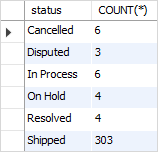
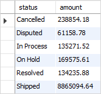
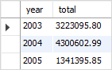
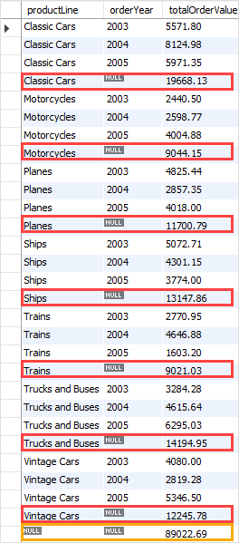

### GROUP BY

*Группирует набор строк в набор итоговых строк по значениям столбцов или выражений. Это GROUP BYпредложение возвращает
одну строку для каждой группы. Другими словами, это уменьшает количество строк в наборе результатов.*

``` sql
SELECT 
    c1, c2,..., cn, aggregate_function(ci)
FROM
    table
WHERE
    where_conditions
GROUP BY c1 , c2,...,cn;
```

``` sql
Узнать количество заказов в каждом статусе
SELECT 
    status, COUNT(*)
FROM
    orders
GROUP BY status;
```



``` sql
Получить общую сумму всех заказов по статусам, вы объединяете таблицу orders с orderdetails таблицей и используете SUM функцию для расчета общей суммы
SELECT 
    status, COUNT(*)
FROM
    orders
GROUP BY status;
```



``` sql
Запрос получает общий объем продаж за каждый год.
SELECT 
    YEAR(orderDate) AS year,
    SUM(quantityOrdered * priceEach) AS total
FROM
    orders
INNER JOIN orderdetails 
    USING (orderNumber)
WHERE
    status = 'Shipped'
GROUP BY 
    YEAR(orderDate);
```



### HAVING

*Используется в SELECT для условий фильтрации для группы строк или агрегатов*

*Предложение HAVING оценивает каждую группу, возвращаемую предложением GROUP BY. Если результат верен, строка включается в набор результатов.*

``` sql
SELECT 
    select_list
FROM 
    table_name
WHERE 
    search_condition
GROUP BY 
    group_by_expression
HAVING 
    group_condition;
```

``` sql
GROUP BY предложение используется для получения номеров заказов, количества проданных товаров по каждому заказу и общего объема продаж для каждого из таблиц orderdetails
Узнать, общий объем продаж какого заказа превышает, 1000
SELECT 
    ordernumber,
    SUM(quantityOrdered) AS itemsCount,
    SUM(priceeach*quantityOrdered) AS total
FROM
    orderdetails
GROUP BY 
   ordernumber
HAVING 
   total > 1000;
```

``` sql
Найти все уже отправленные заказы, общая сумма которых превышает 1500. Вы можете соединить таблицу orderdetails с orders таблицей с помощью INNER JOIN предложения и применить условие к  status столбцу и total агрегату
SELECT 
    a.ordernumber, 
    status, 
    SUM(priceeach*quantityOrdered) total
FROM
    orderdetails a
INNER JOIN orders b 
    ON b.ordernumber = a.ordernumber
GROUP BY  
    ordernumber, 
    status
HAVING 
    status = 'Shipped' AND 
    total > 1500;
```

### HAVING COUNT
``` sql
Получение клиентов, разместивших более четырех заказов
SELECT 
  customerName, 
  COUNT(*) order_count 
FROM 
  orders 
  INNER JOIN customers using (customerNumber) 
GROUP BY 
  customerName 
HAVING 
  COUNT(*) > 4 
ORDER BY 
  order_count;
```

### ROLLUP
*Создает несколько наборов группировки на основе столбцов или выражений, указанных в GROUP BY предложении*

*ROLLUP предложение генерирует не только промежуточные итоги, но и общую сумму значений*
``` sql
Предполагается ROLLUP, что существует следующая иерархия:
c1 > c2 > c3

И он генерирует следующие наборы группировки:
(c1, c2, c3)
(c1, c2)
(c1)
()

Генерирует ROLLUP строку промежуточного итога каждый раз, когда изменяется линия продуктов, и общий итог в конце результата
SELECT 
    productLine, 
    orderYear,
    SUM(orderValue) totalOrderValue
FROM
    sales
GROUP BY 
    productline, 
    orderYear 
WITH ROLLUP;
```
