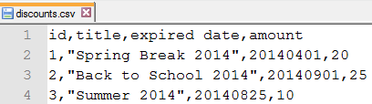

## IMPORT
```sql
используем оператор CREATE TABLE для создания discountsтаблицы следующим образом

CREATE TABLE discounts (
    id INT NOT NULL AUTO_INCREMENT,
    title VARCHAR(255) NOT NULL,
    expired_date DATE NOT NULL,
    amount DECIMAL(10 , 2 ) NULL,
    PRIMARY KEY (id)
);

```

*Следующий  discounts.csvфайл содержит первую строку в качестве заголовков столбцов и три другие строки данных*


```sql
Следующий оператор импортирует данные из   c:\tmp\discounts.csvфайла в discountsтаблицу.

LOAD DATA INFILE 'c:/tmp/discounts.csv' 
INTO TABLE discounts 
FIELDS TERMINATED BY ',' 
ENCLOSED BY '"'
LINES TERMINATED BY '\n'
IGNORE 1 ROWS;
```

## EXPORT
```sql
SELECT 
    orderNumber, status, orderDate, requiredDate, comments
FROM
    orders
WHERE
    status = 'Cancelled' 
INTO OUTFILE 'C:/tmp/cancelled_orders.csv' 
FIELDS ENCLOSED BY '"' 
TERMINATED BY ';' 
ESCAPED BY '"' 
LINES TERMINATED BY '\r\n';
```