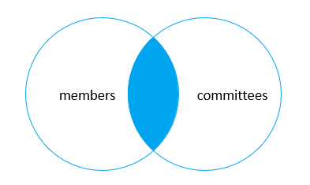
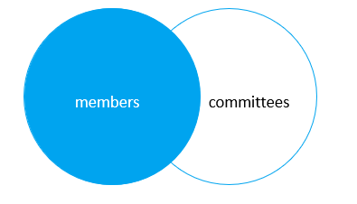

### JOIN
*JOIN — это метод связывания данных между одной ( самообъединение ) или несколькими таблицами на основе значений общего столбца между таблицами.*
``` sql
SELECT column_list
FROM table_1
INNER JOIN table_2 ON join_condition;
```

* Если в условии соединения используется одинаковые имена столбцов в обеих таблицах
``` sql
SELECT column_list
FROM table_1
INNER JOIN table_2 USING (column_name);
```

``` sql
Поиск членов, которые также являются членами комитета
SELECT 
    m.member_id, 
    m.name AS member, 
    c.committee_id, 
    c.name AS committee
FROM
    members m
INNER JOIN committees c USING(name);
```
*или*
``` sql
SELECT 
    m.member_id, 
    m.name AS member, 
    c.committee_id, 
    c.name AS committee
FROM
    members m
INNER JOIN committees c ON c.name = m.name;
```



### LEFT JOIN
*Левое соединение выбирает данные, начиная с левой таблицы. Для каждой строки левой таблицы левое соединение сравнивается с каждой строкой правой таблицы.*

*Левое соединение выбирает все данные из левой таблицы независимо от того, существуют ли соответствующие строки в правой таблице или нет.*

*Если не найдено соответствующих строк из правой таблицы, левое соединение использует значения NULL для столбцов строки из правой таблицы в наборе результатов.*
``` sql
SELECT column_list 
FROM table_1 
LEFT JOIN table_2 USING (column_name);
```
*или*
``` sql
SELECT column_list 
FROM table_1 
LEFT JOIN table_2 ON join_condition;
```

``` sql
Найти продажную цену продукта, код которого S10_1678меньше рекомендуемой розничной цены производителя (MSRP) для этого продукта.
SELECT 
    orderNumber, 
    productName, 
    msrp, 
    priceEach
FROM
    products p
INNER JOIN orderdetails o 
   ON p.productcode = o.productcode
      AND p.msrp > o.priceEach
WHERE
    p.productcode = 'S10_1678';
```




### CROSS JOIN
*Создает декартово произведение строк из объединенных таблиц. Перекрестное соединение объединяет каждую строку из первой таблицы с каждой строкой из правой таблицы для создания набора результатов.*

*Левое соединение выбирает все данные из левой таблицы независимо от того, существуют ли соответствующие строки в правой таблице или нет.*

*Если не найдено соответствующих строк из правой таблицы, левое соединение использует значения NULL для столбцов строки из правой таблицы в наборе результатов.*
``` sql
SELECT select_list
FROM table_1
CROSS JOIN table_2;
```
*или*
``` sql
SELECT 
    m.member_id, 
    m.name AS member, 
    c.committee_id, 
    c.name AS committee
FROM
    members m
CROSS JOIN committees c;
```

