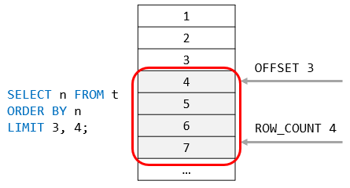

## SQL to be formated
 
### INFORMATION_SCHEMA
*Чтобы увидеть первичный и внешний ключи (ограничения)*
``` sql
SELECT *  
FROM INFORMATION_SCHEMA.KEY_COLUMN_USAGE
WHERE TABLE_SCHEMA = 'classicmodels'
AND TABLE_NAME = 'customers';
```

*Чтобы просмотреть все таблицы в базе данных*
``` sql
SELECT *  
FROM INFORMATION_SCHEMA.tables
WHERE TABLE_SCHEMA = 'classicmodels'; 
```

*Чтобы увидеть структуру одной таблицы (столбцы, типы данных, ключи)*
### DESC
``` sql
desc classicmodels.customers;
```

### ORDER BY
+ ***ASC - возрастание. Стоит по умолчанию.*** 
+ ***DESC - убывание***
``` sql
SELECT 
   column1, column2, column3, ...
FROM 
   table_name
ORDER BY 
   column1 [ASC|DESC], 
   column2 [ASC|DESC],
   ...;
```

### WHERE
``` sql
SELECT 
    select_list
FROM
    table_name
WHERE
    search_condition;
```

# WHERE с другими операторами
### AND
*Оператор AND используется для объединения двух условий*
``` sql
Поиск сотрудников, чьи должности 'Sales Rep' и код офиса равны 1
        WHERE
        jobtitle = 'Sales Rep' AND 
        officeCode = 1;
```

### OR
*Оператор OR оценивается TRUE только в том случае, если одно из выражений имеет значение TRUE*
``` sql
Поиск сотрудников, должность которых = 'Sales Rep' или сотрудников, которые ходят в офис с кодом 1
        WHERE
        jobtitle = 'Sales Rep' OR 
        officeCode = 1;
```

### BETWEEN / NOT BETWEEN
*Оператор BETWEEN Nвозвращает TRUE значение, если значение находится в диапазоне значений*
``` sql
Поиск сотрудников, находящихся в офисах с кодом от 1 до 3
        WHERE
        officeCode BETWEEN 1 AND 3;

Найти продукты, цена покупки которых не находится в диапазоне от 20 до 100        
        WHERE
        buyPrice NOT BETWEEN 20 AND 100;
```

### LIKE
*Оператор LIKE определяет TRUE, соответствует ли значение указанному шаблону:*
+ ***% - любое количество символов***
+ ***_ - один любой символ***
``` sql
Поиск сотрудников, чьи фамилии заканчиваются строкой 'son'
        WHERE
        lastName LIKE '%son'
```

### IN
*Оператор IN возвращает TRUE значение, если значение соответствует любому значению в списке*
``` sql
Поиск сотрудников, которые находятся в офисе с кодом 1, 2 или 3
        WHERE
        officeCode IN (1, 2, 3)
```

### IS NULL
+ *Оператор IS NULL возвращает TRUE значение, если значение равно NULL*
+ *NULL - это маркер, указывающий, что значение отсутствует или неизвестно. NULL не эквивалентен числу 0 или пустой строке.*
``` sql
Получение строк со значениями в столбце reportsTo значения NULL
        WHERE
        reportsTo IS NULL;
```

| Оператор  | Описание                                                                                       | 
|-----------|------------------------------------------------------------------------------------------------|
| "="       | Равно. Вы можете использовать его практически с любым типом данных.                            |
| <> или != | Не равно                                                                                       | 
| <         | Меньше, чем. Обычно вы используете его с числовыми типами данных и типами данных даты/времени. |
| >         | Больше чем.                                                                                    |
| <=        | Меньше или равно                                                                               |
| >=        | Больше или равно                                                                               |

### DISTINCT
``` sql
Выберите уникальные фамилии
SELECT 
    DISTINCT lastname
FROM
    employees
ORDER BY 
    lastname;
```

### NOT IN
*Оператор NOT IN возвращает единицу, если значение не соответствует ни одному значению в списке. В противном случае возвращается 0.*
``` sql
Поиск офисов, которые не находятся в France и USA
SELECT 
    officeCode, 
    city, 
    phone
FROM
    offices
WHERE
    country NOT IN ('USA' , 'France')
ORDER BY 
    city;
```

### LIMIT
*Оператор используется в SELECT для ограничения количества возвращаемых строк*
+ *Задает offset смещение первой возвращаемой строки. offset Первая строка равна 0, а не 1 .*
+ *Определяет row_count максимальное количество возвращаемых строк.*


``` sql
SELECT 
    select_list
FROM
    table_name
LIMIT [offset,] row_count;
```

# ПОДЗАПРОСЫ

