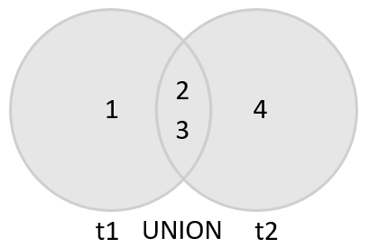

### UNION
*Позволяет объединить два или более наборов результатов запросов в один набор результатов*
``` sql
SELECT column_list
UNION [DISTINCT | ALL]
SELECT column_list
UNION [DISTINCT | ALL]
SELECT column_list
...

```
*Чтобы объединить набор результатов двух или более запросов с помощью UNION оператора, необходимо следовать основным правилам:*

+ Во-первых, количество и порядок столбцов во всех  SELECT операторах должны быть одинаковыми.
+ Во-вторых, типы данных столбцов должны быть одинаковыми или совместимыми.

*По умолчанию UNION оператор удаляет  повторяющиеся строки  , даже если вы не указали DISTINCT оператор явно*

``` sql
Объединяет наборы результатов, полученные из t1таблиц t2
SELECT id
FROM t1
UNION
SELECT id
FROM t2;
```


*Если вы используете UNION ALL явно, повторяющиеся строки, если они доступны, останутся в результате*
``` sql
SELECT id
FROM t1
UNION ALL
SELECT id
FROM t2;
```

``` sql
Объединить имена и фамилии сотрудников и клиентов в единый набор результатов
SELECT 
    firstName, 
    lastName
FROM
    employees 
UNION 
SELECT 
    contactFirstName, 
    contactLastName
FROM
    customers;
```

``` sql
Чтобы различать сотрудников и клиентов, вы можете добавить столбец
Если нужно отсортировать набор результатов объединения, используйте ORDER BY в последнем  SELECT операторе
SELECT 
    CONCAT(firstName, ' ', lastName) fullname, 
    'Employee' as contactType
FROM
    employees 
UNION SELECT 
    CONCAT(contactFirstName, ' ', contactLastName),
    'Customer' as contactType
FROM
    customers
ORDER BY 
    fullname
```